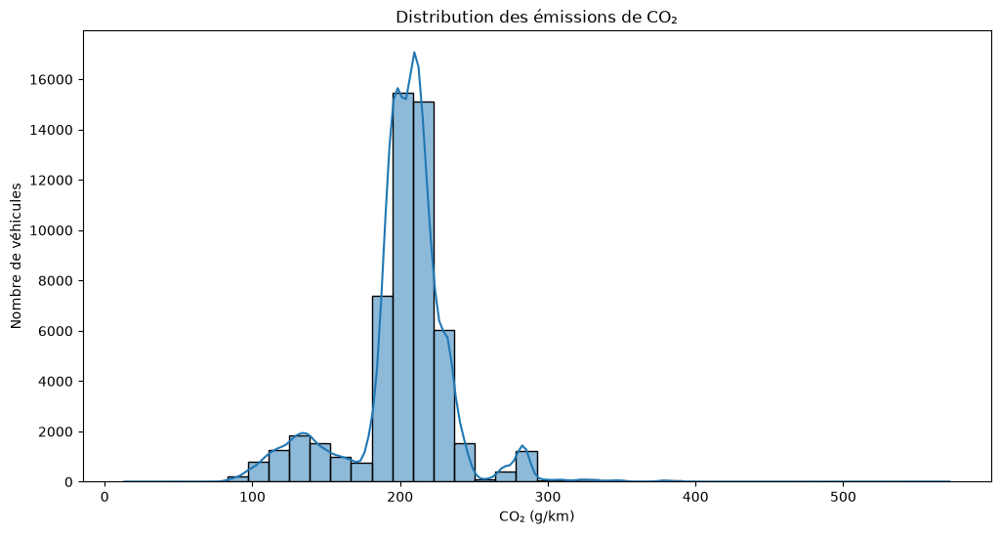
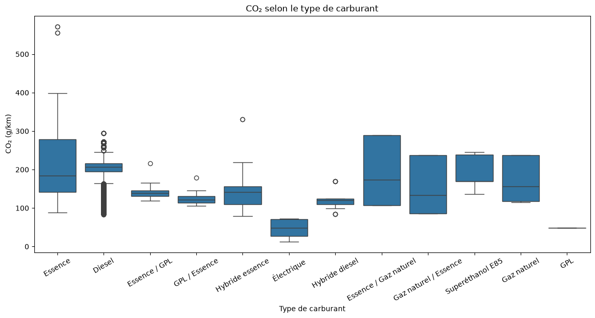
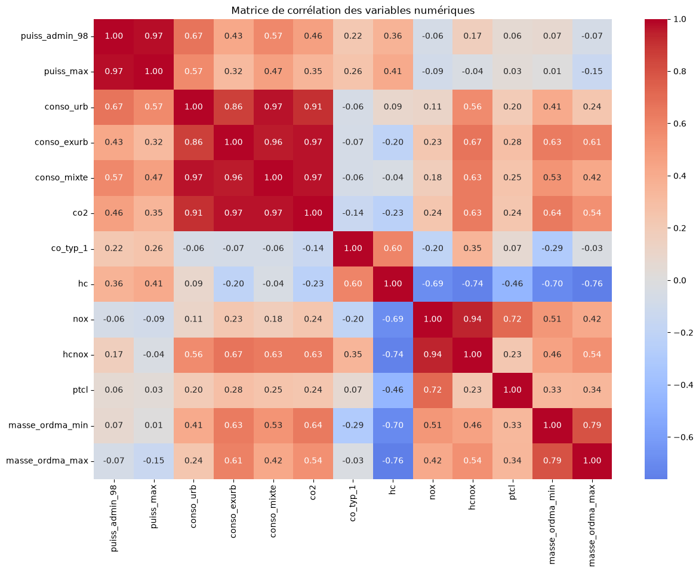

# Analyse exploratoire et prétraitement des données pour la modélisation des émissions de CO₂ des véhicules commercialisés en France

## Projet Data Scientist — Liora (anciennement DataScientest)

**Formation :** Data Scientist – Liora (anciennement DataScientest)

**Projet :** Émissions de CO₂ des véhicules commercialisés en France

**Groupe :**
- Larissa Varnakova
- Aziz Diallo

**Mentor :** Nicolas Mormiche

**Date :** Juin 2026

---

# Sommaire

1. Introduction

2. Contexte et objectifs
   - 2.1 Contexte
   - 2.2 Problématique
   - 2.3 Objectifs du projet

3. Présentation du jeu de données
   - 3.1 Origine des données
   - 3.2 Description du jeu de données
   - 3.3 Variable cible
   - 3.4 Synthèse

4. Analyse exploratoire des données
   - 4.1 Qualité des données
   - 4.2 Analyse descriptive
   - 4.3 Data visualisation
   - 4.4 Synthèse de l'analyse exploratoire

5. Data visualisation et analyses statistiques
   - 5.1 Corrélations
   - 5.2 Analyse de variance (ANOVA)
   - 5.3 Tests de Student
   - 5.4 Synthèse des analyses statistiques

6. Prétraitement des données
   - 6.1 Nettoyage des données
   - 6.2 Traitement des valeurs manquantes
   - 6.3 Feature Engineering
   - 6.4 Détection et traitement des valeurs aberrantes
   - 6.5 Sélection des variables
   - 6.6 Encodage des variables catégorielles
   - 6.7 Préparation des données pour la modélisation
   - 6.8 Synthèse du prétraitement

7. Conclusion

8. Annexes

---

# 1. Introduction

La réduction des émissions de gaz à effet de serre constitue aujourd'hui un enjeu majeur pour le secteur des transports. En France, les véhicules particuliers et utilitaires représentent une part importante des émissions de dioxyde de carbone (CO₂), ce qui conduit les pouvoirs publics et les constructeurs automobiles à renforcer les politiques de réduction de l'impact environnemental des véhicules.

Dans ce contexte, l'analyse des données relatives aux caractéristiques techniques des véhicules permet de mieux comprendre les facteurs influençant les émissions de CO₂. L'identification de ces facteurs constitue une étape essentielle avant la mise en œuvre de modèles prédictifs capables d'estimer les émissions d'un véhicule à partir de ses caractéristiques.

Ce projet s'inscrit dans le cadre de la formation **Data Scientist** de **Liora (anciennement DataScientest)**. Il repose sur l'étude d'un jeu de données regroupant les caractéristiques techniques de véhicules commercialisés en France ainsi que leurs émissions de CO₂. L'objectif est de conduire une démarche complète d'analyse, d'exploration et de préparation des données en vue de leur exploitation par des modèles de Machine Learning.

Ce premier rapport présente les différentes étapes réalisées avant la phase de modélisation. Après une présentation du jeu de données, une analyse exploratoire est menée afin d'en comprendre la structure, d'identifier les principales relations entre les variables et de mettre en évidence les caractéristiques les plus influentes. Les opérations de prétraitement réalisées pour préparer les données à la modélisation sont ensuite détaillées et justifiées.

# 2. Contexte et objectifs

## 2.1 Contexte

La réduction des émissions de gaz à effet de serre constitue un enjeu majeur pour le secteur des transports. En France, les véhicules routiers représentent une part importante des émissions de CO₂, ce qui conduit les pouvoirs publics et les constructeurs automobiles à renforcer les politiques visant à réduire leur impact environnemental.

### Contexte économique et métier

Les réglementations européennes imposent des objectifs de plus en plus exigeants en matière d'émissions de CO₂. Une meilleure compréhension des facteurs influençant ces émissions permet aux constructeurs de développer des véhicules plus performants sur le plan environnemental, d'anticiper les contraintes réglementaires, de limiter les pénalités financières et d'accompagner les consommateurs dans le choix de véhicules moins polluants.

### Contexte scientifique

Les émissions de CO₂ dépendent de nombreuses caractéristiques techniques des véhicules, telles que la consommation de carburant, la puissance, la masse, le type de carburant ou encore l'hybridation. L'analyse de ces variables permet d'identifier les facteurs les plus influents et de mieux comprendre les mécanismes expliquant les différences d'émissions observées entre les véhicules commercialisés en France.

### Contexte technique

Ce projet s'inscrit dans une démarche de Data Science visant à préparer un jeu de données destiné à la modélisation prédictive. Il mobilise les principales étapes d'un projet de Machine Learning : exploration des données, traitement des valeurs manquantes, feature engineering, sélection des variables, encodage des variables catégorielles et préparation des jeux d'entraînement et de test. L'objectif est de construire un jeu de données fiable et directement exploitable par les futurs modèles de prédiction.

## 2.2 Problématique

Les émissions de CO₂ d'un véhicule dépendent de nombreux paramètres techniques, tels que la motorisation, la puissance, la masse, le type de carburant ou encore la consommation. Identifier les variables les plus influentes constitue une étape indispensable avant la mise en œuvre d'un modèle prédictif fiable.

La problématique retenue dans ce projet est donc la suivante :

**Quels sont les principaux facteurs influençant les émissions de CO₂ des véhicules commercialisés en France et comment exploiter ces informations pour construire un modèle de Machine Learning capable de prédire ces émissions ?**

## 2.3 Objectifs du projet

L'objectif principal de ce projet est de préparer un jeu de données fiable et exploitable pour une future phase de modélisation des émissions de CO₂.

Pour atteindre cet objectif, plusieurs étapes ont été réalisées :

- comprendre la structure du jeu de données ;
- évaluer la qualité des données et identifier les éventuelles anomalies ;
- analyser les relations entre les variables grâce à des méthodes statistiques et des visualisations adaptées ;
- mettre en œuvre un prétraitement rigoureux des données (traitement des valeurs manquantes, gestion des variables, encodage et préparation des jeux d'entraînement et de test) ;
- préparer un jeu de données directement exploitable par des modèles de Machine Learning.

### Synthèse du chapitre

Ce chapitre a permis de replacer le projet dans son contexte environnemental et d'en définir les principaux objectifs. La compréhension des facteurs influençant les émissions de CO₂ constitue le fil conducteur de cette étude. Les chapitres suivants présentent successivement le jeu de données utilisé, les analyses exploratoires réalisées ainsi que les différentes étapes de prétraitement mises en œuvre afin de préparer les données à la modélisation.

# 3. Présentation du jeu de données

## 3.1 Origine des données

Le jeu de données utilisé dans ce projet recense les caractéristiques techniques et environnementales des véhicules commercialisés en France en 2014. Il provient de données publiques diffusées par les autorités compétentes et rassemble des informations relatives aux émissions de CO₂, à la consommation de carburant, aux caractéristiques des motorisations ainsi qu'aux principaux polluants réglementés.

Ces données constituent une base pertinente pour analyser les facteurs susceptibles d'influencer les émissions de CO₂ des véhicules et préparer le développement de modèles prédictifs.

## 3.2 Description du jeu de données

Le jeu de données est composé d'observations correspondant à des véhicules commercialisés en France en 2014. Chaque ligne représente un véhicule et chaque colonne décrit une caractéristique technique ou environnementale.

Les variables couvrent notamment :

- les informations d'identification des véhicules ;
- les caractéristiques techniques (puissance, cylindrée, masse, type de carburant, transmission, etc.) ;
- les consommations de carburant ;
- les émissions de CO₂ ;
- les émissions des principaux polluants atmosphériques.

La variable cible retenue pour ce projet est **CO₂**, exprimée en grammes par kilomètre (g/km).

## 3.3 Variable cible

L'objectif de la future phase de modélisation sera de prédire les émissions de CO₂ d'un véhicule à partir de ses caractéristiques.

Cette variable quantitative constitue donc la variable cible de l'ensemble des analyses réalisées dans ce rapport. Les différentes étapes d'exploration et de prétraitement visent à identifier les variables les plus pertinentes et à préparer un jeu de données de qualité afin d'améliorer les performances des futurs modèles de Machine Learning.

## 3.4 Synthèse

Le jeu de données présente une richesse importante grâce à la diversité des informations techniques et environnementales disponibles pour chaque véhicule. Cette variété de variables permet d'étudier les principaux facteurs associés aux émissions de CO₂ tout en préparant un jeu de données adapté aux futures étapes de modélisation.

# 4. Analyse exploratoire des données

L'analyse exploratoire constitue une étape essentielle de tout projet de Data Science. Elle permet de comprendre la structure du jeu de données, d'évaluer sa qualité, d'identifier d'éventuelles anomalies et de mettre en évidence les premières relations entre les variables.

Cette phase conditionne l'ensemble des traitements réalisés par la suite. Elle permet notamment d'orienter les choix de prétraitement, de sélectionner les variables les plus pertinentes et de préparer les données en vue de leur future modélisation.

## 4.1 Qualité des données

La première étape de l'analyse exploratoire a consisté à examiner la structure générale du jeu de données afin d'en évaluer la qualité et la cohérence.

Le jeu de données est composé de **55 044 observations** décrites par **30 variables**. Il regroupe des informations relatives aux caractéristiques techniques des véhicules, à leur motorisation, à leur consommation de carburant ainsi qu'à leurs émissions de CO₂ et d'autres polluants réglementés.

L'examen des types de variables met en évidence une majorité de variables catégorielles (chaînes de caractères) décrivant notamment les marques, les modèles, les carburants ou les transmissions, ainsi que plusieurs variables numériques correspondant aux caractéristiques techniques et environnementales des véhicules.

L'analyse des valeurs maquantes révèle que la majorité des variables sont complètes. En revanche, certaines variables présentent un taux important de valeurs manquantes. Les colonnes `Unnamed: 26` à `Unnamed: 29` sont entièrement vides (100 % de valeurs manquantes) et ne contiennent aucune information exploitable. La variable `date_maj` présente plus de **94 %** de valeurs manquantes, tandis que les variables `hc` et `hcnox` affichent respectivement environ **82 %** et **18 %** de données absentes.

À l'inverse, les variables directement liées à la problématique du projet présentent un très faible taux de valeurs manquantes. Les variables `ptcl`, `nox` et `co_typ_1`, qui seront conservées pour la suite des analyses, comportent moins de **5 %** de valeurs manquantes. Elles pourront donc être traitées lors de la phase de prétraitement sans dégrader significativement la qualité du jeu de données.

Cette première analyse confirme que le jeu de données est globalement de bonne qualité et qu'il est adapté à une démarche de modélisation après un prétraitement ciblé des variables concernées.

### Synthèse

L'analyse de la qualité des données met en évidence un jeu de données riche et globalement exploitable. Les principales difficultés concernent un nombre limité de variables fortement incomplètes, qui seront supprimées ou écartées de l'analyse. Les variables utiles à la modélisation présentent quant à elles très peu de valeurs manquantes, ce qui constitue un point favorable pour la suite du projet.

## 4.2 Analyse descriptive

Après avoir vérifié la qualité générale du jeu de données, une analyse descriptive a été réalisée afin de mieux comprendre les caractéristiques des véhicules étudiés.

Comme l'illustre la **Figure 1**, l'examen des statistiques descriptives met en évidence une forte hétérogénéité des véhicules commercialisés en France en 2014. Les variables quantitatives, telles que la puissance du moteur, la cylindrée, la masse, la consommation de carburant ou encore les émissions de CO₂, présentent une dispersion importante, traduisant la diversité des modèles présents dans le jeu de données.

**Figure 1 – Figure 1 – Distribution des émissions de CO₂ des véhicules du jeu de données.**

L'analyse de la variable cible montre que les émissions de CO₂ couvrent une plage de valeurs étendue, reflétant la coexistence de véhicules faiblement émetteurs et de véhicules plus énergivores. Cette variabilité constitue un point favorable pour la future phase de modélisation, puisqu'elle permettra aux modèles d'apprendre sur un ensemble représentatif de situations.

Les statistiques descriptives mettent également en évidence la présence de valeurs extrêmes pour certaines variables techniques. Une analyse spécifique des valeurs aberrantes sera réalisée lors de la phase de prétraitement afin de déterminer si ces observations correspondent à de véritables véhicules atypiques ou à d'éventuelles anomalies.

Enfin, l'analyse des variables catégorielles révèle une répartition déséquilibrée entre certaines modalités. Les motorisations essence et diesel sont largement majoritaires, tandis que les motorisations hybrides et électriques sont présentes en effectifs beaucoup plus faibles, ce qui est cohérent avec le marché automobile français en 2014.

### Synthèse

L'analyse descriptive met en évidence un jeu de données riche et varié, représentatif des véhicules commercialisés en France en 2014. La diversité des caractéristiques observées constitue un atout pour la modélisation, tout en justifiant la réalisation d'analyses statistiques et graphiques plus approfondies afin d'identifier les variables les plus influentes sur les émissions de CO₂.

## 4.3 Analyse graphique des données

Les visualisations réalisées au cours de l'analyse exploratoire ont permis de compléter les statistiques descriptives en mettant en évidence plusieurs relations importantes entre les caractéristiques techniques des véhicules et leurs émissions de CO₂.

L'étude de la distribution des émissions de CO₂ montre une forte variabilité des niveaux d'émission entre les véhicules commercialisés en France en 2014. Cette dispersion confirme l'intérêt de rechercher les variables les plus explicatives afin d'améliorer les performances des futurs modèles prédictifs.

Comme l'illustre la **Figure 2**, la consommation de carburant présente une relation positive très marquée avec les émissions de CO₂. Une augmentation de la consommation s'accompagne systématiquement d'une augmentation des émissions. Cette tendance est particulièrement nette pour la consommation mixte, qui apparaît comme le meilleur indicateur des émissions de CO₂ parmi les différentes mesures de consommation. Ce résultat constitue l'un des principaux enseignements de l'analyse exploratoire et justifiera les choix réalisés lors de la phase de sélection des variables.

**Figure 2 – Relation entre la consommation mixte de carburant et les émissions de CO₂.**

Comme l'illustre la **Figure 4**, les émissions de CO₂ varient sensiblement selon le type de carburant. Les véhicules hybrides présentent globalement les niveaux d'émissions les plus faibles, tandis que les motorisations essence et diesel affichent des émissions plus élevées ainsi qu'une plus grande dispersion.

**Figure 4 – Distribution des émissions de CO₂ selon le type de carburant.**

La **Figure 4** met également en évidence une dispersion plus importante des émissions pour les motorisations essence et diesel. Les motorisations hybrides apparaissent plus homogènes et présentent globalement des niveaux d'émissions plus faibles.

Enfin, l'analyse des corrélations confirme que les variables liées à la consommation de carburant figurent parmi les meilleurs indicateurs des émissions de CO₂. À l'inverse, certaines variables techniques présentent une influence beaucoup plus limitée et seront réévaluées lors de la phase de sélection des variables.

### Synthèse

Les analyses graphiques mettent en évidence une forte association entre les émissions de CO₂ et les caractéristiques techniques des véhicules. La consommation de carburant apparaît comme la variable la plus fortement associée aux émissions, tandis que le type de carburant contribue également à expliquer une partie de la variabilité observée. Ces résultats confortent les analyses statistiques présentées dans le chapitre suivant et guideront les choix réalisés lors du prétraitement des données.

## 4.4 Synthèse de l'analyse exploratoire

L'analyse exploratoire a permis d'acquérir une compréhension approfondie du jeu de données et d'identifier les principaux facteurs susceptibles d'influencer les émissions de CO₂ des véhicules.

Le jeu de données présente une qualité globale satisfaisante. Les quelques valeurs manquantes observées concernent un nombre limité de variables d'intérêt et pourront être traitées sans perte significative d'information lors de la phase de prétraitement.

Les analyses descriptives et graphiques montrent que les émissions de CO₂ sont fortement liées à la consommation de carburant. La puissance du moteur, la masse du véhicule et le type de carburant apparaissent également comme des variables explicatives importantes, bien que leur influence soit moins marquée.

Les analyses statistiques réalisées confirment les observations issues des visualisations et mettent en évidence des relations significatives entre plusieurs variables explicatives et la variable cible. Elles permettent ainsi de conforter les choix qui seront réalisés lors du prétraitement et de la future phase de modélisation.

Cette analyse exploratoire constitue une étape essentielle du projet. Elle a permis de mettre en évidence les principales caractéristiques du jeu de données, d'identifier les variables les plus pertinentes et de définir une stratégie de prétraitement adaptée aux objectifs de modélisation des émissions de CO₂.

# 5. Data visualisation et analyses statistiques

Les analyses statistiques ont été réalisées afin de compléter les observations issues de l'analyse exploratoire et de confirmer, de manière objective, les relations mises en évidence par les différentes visualisations.

Cette étape permet de distinguer les relations les plus significatives entre les variables explicatives et les émissions de CO₂, tout en apportant des éléments d'aide à la décision pour la future phase de modélisation.

Les analyses présentées dans ce chapitre s'appuient successivement sur l'étude des corrélations, les analyses de variance (ANOVA) et les tests de Student.

## 5.1 Corrélations

L'étude des corrélations a permis d'identifier les variables quantitatives les plus fortement associées aux émissions de CO₂.

Comme l'illustre la **Figure 3**, la matrice de corrélation met en évidence une forte relation positive entre les émissions de CO₂ et les différentes mesures de consommation de carburant. La consommation mixte (`conso_mixte`) présente la corrélation la plus élevée avec les émissions de CO₂ (≈ 0,97), suivie des consommations urbaine (`conso_urb`) et extra-urbaine (`conso_exurb`).

**Figure 3 – Matrice de corrélation des principales variables quantitatives.**

Les variables relatives à la masse du véhicule présentent également des corrélations positives importantes avec les émissions de CO₂. À l'inverse, certaines variables techniques montrent des coefficients de corrélation plus faibles, traduisant une influence plus limitée sur les émissions.

Les coefficients de Pearson et de Spearman ont permis de confirmer ces résultats. Malgré des approches différentes (relation linéaire pour Pearson et relation monotone pour Spearman), les deux méthodes conduisent aux mêmes conclusions générales concernant les variables les plus influentes.

Ces résultats montrent que les variables liées à la consommation constituent les meilleurs indicateurs des émissions de CO₂. Ces observations ont directement guidé les choix réalisés lors de la phase de prétraitement, notamment la sélection des variables conservées pour la modélisation.

### Synthèse

Les analyses de corrélation mettent clairement en évidence le rôle prépondérant de la consommation de carburant dans l'explication des émissions de CO₂. La masse du véhicule apparaît également comme un facteur important, tandis que plusieurs autres variables présentent une contribution plus limitée.

## 5.2 Analyse de variance (ANOVA)

Afin d'évaluer l'influence de plusieurs variables catégorielles sur les émissions de CO₂, des analyses de variance (ANOVA) ont été réalisées.

Une première ANOVA a porté sur le type de carburant. Les résultats mettent en évidence des différences statistiquement significatives entre les différentes motorisations. Les émissions moyennes de CO₂ varient selon le carburant utilisé, confirmant que cette variable constitue un facteur explicatif majeur des émissions des véhicules.

Une deuxième analyse a été réalisée selon le type de carrosserie. Les résultats montrent également des différences significatives entre les différentes catégories de véhicules. Certaines carrosseries présentent des niveaux d'émissions moyens plus élevés que d'autres, traduisant des usages et des caractéristiques techniques différents.

Enfin, une troisième ANOVA a été menée selon la gamme des véhicules. Là encore, les différences observées entre les groupes sont statistiquement significatives. Les véhicules appartenant aux gammes supérieures présentent généralement des émissions de CO₂ plus importantes, ce qui s'explique notamment par une masse et une puissance plus élevées.

L'ensemble de ces résultats confirme que les variables catégorielles étudiées exercent une influence significative sur les émissions de CO₂. Elles devront donc être prises en compte lors de la phase de modélisation.

### Synthèse

Les analyses de variance montrent que le type de carburant, la carrosserie et la gamme du véhicule influencent significativement les émissions de CO₂. Ces résultats confirment les observations réalisées lors de l'analyse exploratoire et justifient la conservation de ces variables dans le processus de modélisation.

## 5.3 Tests de Student

Un test de Student a été réalisé afin de comparer les émissions moyennes de CO₂ entre les véhicules hybrides et les véhicules non hybrides.

Comme l'illustre la **Figure 5**, les véhicules hybrides présentent des émissions de CO₂ globalement plus faibles que les véhicules non hybrides. Cette différence visuelle suggère que les deux groupes ne suivent pas la même distribution, ce qui justifie la réalisation d'un test de Student afin de déterminer si cet écart est statistiquement significatif.

**Figure 5 – Distribution des émissions de CO₂ selon le type d'hybridation des véhicules.**

Les résultats du test mettent en évidence une différence statistiquement significative entre les deux groupes. Les véhicules hybrides présentent des émissions moyennes de CO₂ significativement plus faibles que les véhicules non hybrides. Ce résultat confirme les observations réalisées lors de l'analyse exploratoire et souligne l'impact du type d'hybridation sur les émissions de CO₂.

Au-delà de son intérêt statistique, ce résultat est cohérent avec les caractéristiques techniques des véhicules hybrides, conçus pour réduire la consommation de carburant et, par conséquent, les émissions de dioxyde de carbone.

### Synthèse

Le test de Student confirme que les véhicules hybrides émettent significativement moins de CO₂ que les véhicules non hybrides. Ce résultat renforce les conclusions issues des analyses graphiques et met en évidence l'influence de la motorisation sur les émissions des véhicules.

## 5.4 Synthèse des analyses statistiques

Les analyses statistiques ont permis de confirmer les principales tendances observées lors de l'analyse exploratoire.

L'étude des corrélations met en évidence le rôle prépondérant des variables liées à la consommation de carburant dans l'explication des émissions de CO₂. Les analyses de variance montrent que plusieurs variables catégorielles, telles que le type de carburant, la carrosserie et la gamme des véhicules, influencent significativement les niveaux d'émissions observés. Enfin, le test de Student confirme que les véhicules hybrides présentent des émissions de CO₂ significativement plus faibles que les véhicules non hybrides.

Ces résultats permettent d'identifier les variables les plus pertinentes pour la suite du projet et confortent les choix réalisés lors du prétraitement des données. Ils constituent également une base solide pour la future phase de modélisation, en mettant en évidence les variables susceptibles de contribuer le plus efficacement à la prédiction des émissions de CO₂.

Les enseignements tirés de cette analyse guideront les différentes étapes de préparation des données présentées dans le chapitre suivant, notamment le traitement des valeurs manquantes, la sélection des variables, l'encodage des variables catégorielles et la constitution des jeux de données destinés aux modèles de Machine Learning.

# 6. Prétraitement des données

Le prétraitement constitue une étape essentielle d'un projet de Machine Learning. Son objectif est de transformer le jeu de données brut en un jeu de données fiable, cohérent et directement exploitable par les algorithmes de modélisation.

Les choix réalisés au cours de cette étape reposent sur les conclusions de l'analyse exploratoire et des analyses statistiques présentées dans les chapitres précédents. Chaque transformation a été réalisée dans le but d'améliorer la qualité des données tout en limitant les risques de biais ou de fuite d'information (*data leakage*).

Le prétraitement a été réalisé selon une démarche progressive comprenant le nettoyage des données, le traitement des valeurs manquantes, le **feature engineering**, la **sélection des variables**, l'encodage des variables catégorielles ainsi que la préparation des jeux de données destinés à la phase de modélisation.

## 6.1 Nettoyage des données

Avant toute transformation, le jeu de données a fait l'objet d'un nettoyage afin de supprimer les informations inutiles ou non exploitables pour la modélisation.

Les premières analyses ont mis en évidence plusieurs colonnes entièrement vides (`Unnamed: 26` à `Unnamed: 29`) ainsi qu'une variable (`date_maj`) présentant une proportion très importante de valeurs manquantes. Ces variables n'apportant aucune information pertinente pour l'étude, elles ont été supprimées.

Certaines variables descriptives ont également été écartées au cours du prétraitement. Bien qu'utiles pour l'identification des véhicules, elles n'apportaient pas de pouvoir explicatif direct pour la prédiction des émissions de CO₂ et risquaient d'augmenter inutilement la complexité du modèle.

Enfin, la variable cible (`co2`) a été séparée des variables explicatives avant le début des traitements de prétraitement. Cette séparation garantit que les transformations appliquées aux variables explicatives ne modifient jamais la variable à prédire.

Par ailleurs, le découpage entre les jeux d'entraînement et de test a été réalisé avant les étapes d'imputation et d'encodage. Ce choix permet d'éviter toute fuite d'information (*data leakage*) entre les données utilisées pour entraîner les modèles et celles réservées à leur évaluation.

### Synthèse

Le nettoyage des données a permis de supprimer les variables inutiles et de préparer un jeu de données cohérent pour les étapes suivantes du prétraitement. La séparation précoce des jeux d'entraînement et de test garantit également une évaluation fiable des futurs modèles de Machine Learning.

## 6.2 Traitement des valeurs manquantes

L'analyse exploratoire a mis en évidence la présence de valeurs manquantes sur les variables `ptcl`, `nox` et `co_typ_1`. Leur faible taux de données manquantes (inférieur à 5 %) permettait d'envisager une imputation tout en conservant l'ensemble des observations du jeu de données.

Avant de retenir une stratégie d'imputation, plusieurs approches ont été étudiées. Une imputation par marque de véhicule a notamment été envisagée. Cette solution n'a toutefois pas été retenue en raison de la forte disparité des effectifs entre les marques, certaines étant représentées par un nombre très limité de véhicules. Une telle approche aurait conduit à calculer des médianes sur des échantillons insuffisamment représentatifs.

L'analyse des médianes par type de carburant a ensuite montré que les variables `nox` et `co_typ_1` présentaient des différences importantes entre les motorisations essence et diesel. Cette caractéristique justifiait une imputation tenant compte du type de carburant.

Les stratégies retenues sont donc les suivantes :

- **`ptcl`** : imputation par la médiane globale calculée sur le jeu d'entraînement ;
- **`nox`** : imputation par la médiane du type de carburant (`cod_cbr`), avec recours à la médiane globale lorsque la catégorie ne permettait pas de calculer une médiane ;
- **`co_typ_1`** : même stratégie que pour `nox`, fondée sur la médiane par type de carburant complétée, si nécessaire, par une médiane globale.

Conformément aux bonnes pratiques du Machine Learning, toutes les statistiques d'imputation ont été calculées exclusivement sur le jeu d'entraînement (`X_train`), puis appliquées à la fois au jeu d'entraînement et au jeu de test. Cette démarche garantit l'absence de fuite d'information (*data leakage*) entre les deux jeux de données.

La vérification réalisée après l'imputation montre qu'aucune valeur manquante ne subsiste pour les variables `ptcl`, `nox` et `co_typ_1`, confirmant la bonne application du prétraitement.

### Synthèse

Le traitement des valeurs manquantes repose sur une stratégie adaptée à chaque variable. Le choix d'une imputation par la médiane globale ou par la médiane conditionnelle selon le type de carburant permet de préserver les caractéristiques des données tout en respectant les bonnes pratiques du Machine Learning. Cette étape aboutit à un jeu de données complet, prêt pour les traitements suivants.

## 6.3 Feature Engineering

Dans le cadre du prétraitement, plusieurs variables dérivées ont été envisagées afin d'améliorer le pouvoir explicatif du jeu de données.

Une première variable a été créée en calculant le rapport entre la puissance maximale du moteur (`puiss_max`) et la masse minimale du véhicule (`masse_ordma_min`). L'objectif était de représenter le niveau de puissance rapporté au poids du véhicule, un indicateur susceptible d'influencer les émissions de CO₂.

L'analyse de cette nouvelle variable montre toutefois une corrélation linéaire faible avec les émissions de CO₂ (≈ 0,089). Ce résultat indique que ce ratio n'apporte pas d'information complémentaire significative par rapport aux variables déjà présentes dans le jeu de données. Cette variable a donc été supprimée.

Une seconde variable, fondée sur le rapport entre la puissance maximale et la masse maximale du véhicule (`masse_ordma_max`), a également été évaluée. Là encore, la corrélation observée avec les émissions de CO₂ est restée très faible (≈ 0,054), confirmant l'absence d'apport explicatif dans cette première approche.

Ces essais illustrent une démarche de feature engineering consistant à créer puis à évaluer objectivement de nouvelles variables avant de décider de leur conservation. Dans notre cas, les deux variables créées n'apportaient pas d'amélioration significative et ont donc été retirées du jeu de données afin de conserver un prétraitement simple et pertinent.

### Synthèse

Les variables dérivées créées au cours du feature engineering ont été évaluées à l'aide de leur corrélation avec les émissions de CO₂. Les deux ratios puissance/masse testés présentant un faible pouvoir explicatif, ils n'ont pas été conservés. Cette démarche illustre l'importance d'évaluer l'intérêt réel d'une nouvelle variable avant de l'intégrer à un modèle de Machine Learning.

## 6.4 Détection et traitement des valeurs aberrantes

La présence de valeurs aberrantes a été étudiée sur les principales variables quantitatives du jeu de données, notamment les émissions de CO₂, les consommations de carburant, la puissance du moteur et la masse des véhicules.

Des boxplots ont été réalisés afin d'identifier les observations situées à l'extérieur des intervalles habituels de chaque distribution. Ces visualisations mettent effectivement en évidence plusieurs valeurs extrêmes.

Une analyse de ces observations montre toutefois qu'elles correspondent à des véhicules réels présentant des caractéristiques techniques particulières, tels que des véhicules très puissants, très lourds ou à forte consommation. Aucune valeur manifestement incohérente ou résultant d'une erreur de saisie n'a été identifiée.

Dans ce contexte, le choix a été fait de conserver l'ensemble des observations. La suppression de ces véhicules aurait conduit à réduire artificiellement la variabilité du jeu de données et à écarter des situations pourtant représentatives du marché automobile.

### Synthèse

L'étude des valeurs aberrantes montre que les observations extrêmes correspondent à des cas réels et non à des anomalies de données. Elles ont donc été conservées afin de préserver toute la diversité du jeu de données et de garantir une modélisation représentative des véhicules commercialisés en France en 2014.

## 6.5 Sélection des variables

Après le traitement des valeurs manquantes, le feature engineering et l'analyse des valeurs aberrantes, une étape de sélection des variables a été réalisée afin d'identifier les variables les plus pertinentes pour la modélisation.

Cette analyse s'appuie sur les résultats de l'analyse exploratoire, les corrélations observées entre les variables ainsi que sur les connaissances métier relatives aux caractéristiques techniques des véhicules. L'objectif est de limiter la redondance entre les variables explicatives, de réduire la complexité du modèle et de conserver uniquement les informations les plus pertinentes pour prédire les émissions de CO₂.

Les variables numériques ont tout d'abord été étudiées. La variable `champ_v9`, correspondant à une référence réglementaire d'homologation, a été supprimée en raison de son faible intérêt pour la modélisation. La variable `puiss_admin_98` a également été écartée, sa très forte corrélation avec `puiss_max` (0,973) traduisant une redondance importante. De même, les variables `conso_urb` et `conso_exurb` ont été supprimées au profit de `conso_mixte`, plus représentative de la consommation globale du véhicule et fortement corrélée aux émissions de CO₂. En revanche, les variables `masse_ordma_min` et `masse_ordma_max` ont été conservées, leur corrélation (0,795) restant insuffisante pour justifier la suppression de l'une d'elles.

Les variables textuelles ont ensuite été analysées. Les variables `cnit`, `tvv`, `dscom`, `lib_mod` et `lib_mod_doss` n'ont pas été retenues en raison de leur forte cardinalité, de leur nature technique ou de leur faible valeur ajoutée pour la modélisation. À l'inverse, les variables `lib_mrq`, `cod_cbr`, `hybride`, `Carrosserie`, `gamme` et `typ_boite_nb_rapp` ont été conservées afin d'être encodées avant la phase de modélisation.

### Synthèse

La sélection des variables a permis de supprimer les variables jugées redondantes ou peu pertinentes tout en conservant les caractéristiques les plus informatives du jeu de données. Cette étape contribue à simplifier le modèle, à limiter la redondance entre les variables explicatives et à préparer un encodage plus pertinent des variables catégorielles.

## 6.6 Encodage des variables catégorielles

À l'issue de la sélection des variables, les variables catégorielles retenues ont été transformées afin d'être exploitables par les algorithmes de Machine Learning.

Les variables conservées pour cette étape sont :

- `cod_cbr` (type de carburant) ;
- `hybride` ;
- `Carrosserie` ;
- `gamme` ;
- `lib_mrq` (marque du véhicule) ;
- `typ_boite_nb_rapp` (type de boîte de vitesses et nombre de rapports).

Les variables `cnit`, `tvv`, `dscom`, `lib_mod` et `lib_mod_doss` n'ont pas été encodées, car elles ont été écartées lors de l'étape de sélection des variables en raison de leur forte cardinalité, de leur nature technique ou de leur faible valeur ajoutée pour la modélisation.

L'encodage a été réalisé à l'aide de **OneHotEncoder** de la bibliothèque *scikit-learn*. Conformément aux bonnes pratiques du Machine Learning, l'encodeur a été ajusté uniquement sur le jeu d'entraînement (`X_train`), puis appliqué au jeu de test (`X_test`). Cette démarche permet d'éviter toute fuite d'information (*data leakage*).

Le paramètre `drop="first"` a été utilisé afin de supprimer une modalité de référence pour chaque variable catégorielle. Ce choix permet d'éviter une colinéarité parfaite entre les variables créées tout en conservant l'information utile à la modélisation.

Le paramètre `handle_unknown="ignore"` a également été retenu afin de garantir qu'une modalité absente du jeu d'entraînement mais présente dans le jeu de test puisse être traitée sans provoquer d'erreur lors de la transformation.

L'encodage des variables catégorielles retenues a ainsi permis de générer un ensemble de variables indicatrices directement exploitables par les futurs modèles de Machine Learning.

### Synthèse

L'encodage des variables catégorielles a permis de transformer les variables qualitatives retenues en variables numériques tout en respectant les bonnes pratiques du Machine Learning. Réalisé après la sélection des variables et ajusté uniquement sur le jeu d'entraînement, il garantit un prétraitement robuste, cohérent et directement exploitable par les futurs modèles de prédiction.

## 6.7 Préparation des données pour la modélisation

La dernière étape du prétraitement a consisté à constituer les jeux de données définitifs qui seront utilisés lors de la phase de modélisation.

Conformément aux décisions prises lors de la sélection des variables, les variables numériques et textuelles jugées peu pertinentes ou redondantes ont été supprimées des jeux d'entraînement et de test avant l'encodage des variables catégorielles.

Les variables catégorielles retenues ont ensuite été transformées à l'aide d'un encodage One-Hot afin d'obtenir des jeux de données entièrement numériques.

Plusieurs contrôles ont ensuite été réalisés afin de vérifier la qualité des jeux de données obtenus. Les dimensions des jeux d'entraînement et de test ont été comparées afin de s'assurer de leur cohérence après l'ensemble des transformations. Les types des variables ont également été vérifiés pour confirmer que toutes les variables étaient désormais numériques.

Une dernière vérification a permis de confirmer l'absence de valeurs manquantes dans les jeux de données finaux. Enfin, un aperçu des premières observations a été réalisé afin de contrôler le bon déroulement de l'ensemble des étapes de prétraitement.

Ces différentes vérifications garantissent que les jeux de données sont complets, cohérents et directement exploitables pour entraîner et évaluer les futurs modèles de Machine Learning.

### Synthèse

Les jeux d'entraînement et de test obtenus à l'issue du prétraitement sont désormais entièrement préparés pour la phase de modélisation. Toutes les variables sont numériques, aucune valeur manquante ne subsiste et les différentes transformations ont été appliquées selon un pipeline cohérent respectant les bonnes pratiques du Machine Learning.

## 6.8 Synthèse du prétraitement

Le prétraitement des données a permis de transformer le jeu de données brut en un ensemble de données fiable, cohérent et directement exploitable pour la phase de modélisation.

Chaque étape a été guidée par les conclusions de l'analyse exploratoire et des analyses statistiques. Les variables inutiles ou incomplètes ont été supprimées, les valeurs manquantes ont été imputées selon une stratégie adaptée, les nouvelles variables créées ont été évaluées avant d'être conservées ou supprimées, les valeurs aberrantes ont été analysées, puis une étape de sélection des variables a permis d'écarter les variables redondantes ou présentant un faible intérêt pour la modélisation.

Les variables catégorielles retenues ont ensuite été transformées grâce à un encodage One-Hot, réalisé uniquement sur le jeu d'entraînement avant d'être appliqué au jeu de test, conformément aux bonnes pratiques visant à éviter toute fuite d'information (*data leakage*).

Les jeux de données obtenus sont désormais complets, cohérents et entièrement numériques. Ils constituent une base solide pour la mise en œuvre et l'évaluation des futurs modèles de prédiction des émissions de CO₂.

Ce prétraitement illustre l'importance d'une préparation rigoureuse des données avant toute phase de modélisation. Les choix réalisés ne résultent pas de traitements systématiques, mais d'une analyse progressive du jeu de données, d'une évaluation statistique des variables et d'une réflexion visant à construire un modèle à la fois performant, robuste et interprétable.

# 7. Conclusion

Ce premier livrable a permis de poser les bases du projet de prédiction des émissions de CO₂ des véhicules commercialisés en France. L'ensemble des travaux réalisés a suivi une démarche méthodique, depuis la compréhension du jeu de données jusqu'à la préparation d'un jeu de données prêt à être exploité par des modèles de Machine Learning.

L'analyse exploratoire a permis d'acquérir une connaissance approfondie des données, d'évaluer leur qualité et d'identifier les principales variables associées aux émissions de CO₂. Les analyses descriptives, les visualisations et les tests statistiques ont notamment mis en évidence le rôle prépondérant de la consommation de carburant, ainsi que l'influence de la puissance, de la masse, du type de carburant, de l'hybridation, de la carrosserie et de la gamme des véhicules.

Ces résultats ont guidé les différentes étapes du prétraitement. Les choix réalisés en matière de traitement des valeurs manquantes, de feature engineering, de sélection des variables et d'encodage des variables catégorielles reposent sur les analyses menées en amont et respectent les bonnes pratiques du Machine Learning, notamment en limitant les risques de fuite d'information (*data leakage*).

À l'issue de ce travail, les jeux de données d'entraînement et de test sont désormais complets, cohérents et entièrement exploitables pour la phase de modélisation. Les variables retenues ont été sélectionnées selon des critères statistiques et métier, afin de conserver les informations les plus pertinentes tout en limitant la redondance entre les variables explicatives.

La prochaine étape du projet consistera à développer et comparer plusieurs modèles de Machine Learning capables de prédire les émissions de CO₂ des véhicules. Les performances de ces modèles seront évaluées à l'aide de métriques adaptées, puis analysées afin d'identifier la solution offrant le meilleur compromis entre précision, robustesse et interprétabilité.

Ce premier livrable met en évidence l'importance d'une démarche rigoureuse d'exploration, d'analyse et de préparation des données avant toute phase de modélisation. Les choix réalisés tout au long de ce travail reposent sur des analyses objectives et des critères statistiques, permettant de constituer une base de données fiable et pertinente pour développer des modèles de prédiction robustes et interprétables.

# 8. Annexes

## Annexe A – Description des principales variables

| Variable        | Description                    |
| --------------- | ------------------------------ |
| co2             | Émissions de CO₂ (g/km)        |
| conso_mixte     | Consommation mixte (l/100 km)  |
| puiss_max       | Puissance maximale (kW)        |
| masse_ordma_min | Masse minimale homologuée (kg) |
| masse_ordma_max | Masse maximale homologuée (kg) |
| cod_cbr         | Type de carburant              |
| hybride         | Véhicule hybride (oui/non)     |
| Carrosserie     | Type de carrosserie            |
| gamme           | Gamme commerciale              |
| lib_mrq         | Marque du véhicule             |

## Annexe B – Résultats détaillés des tests statistiques

Les résultats détaillés des analyses statistiques réalisées au cours du projet (corrélations de Pearson et de Spearman, analyses de variance ANOVA, tests de Student et tests du Khi-deux) sont disponibles dans les notebooks d'analyse exploratoire fournis avec le projet.

Le présent rapport présente uniquement les principaux résultats nécessaires à leur interprétation. Les notebooks permettent, quant à eux, d'accéder à l'ensemble des calculs, tableaux de résultats et sorties détaillées.

## Annexe C – Environnement technique

Les analyses ont été réalisées sous Python à l'aide d'un notebook Jupyter exécuté dans Visual Studio Code.

Les principales bibliothèques utilisées sont :

- pandas
- numpy
- matplotlib
- seaborn
- scipy
- scikit-learn

La gestion des versions et le travail collaboratif ont été assurés à l'aide de Git et GitHub.