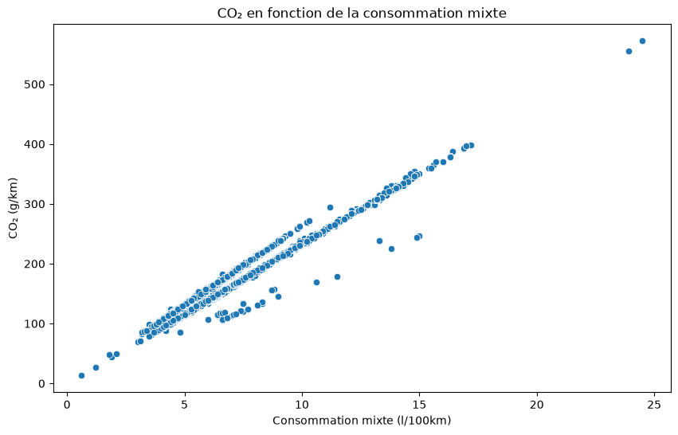
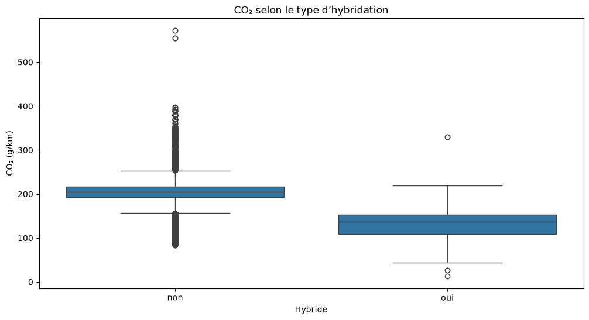
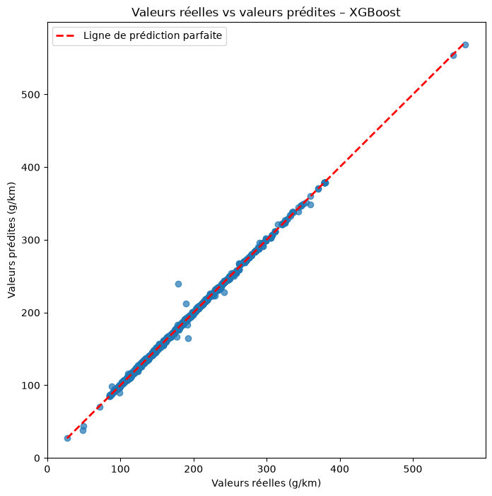
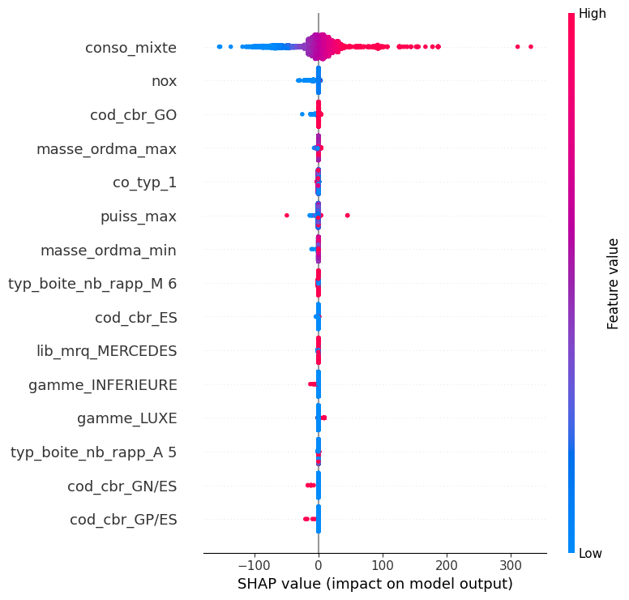
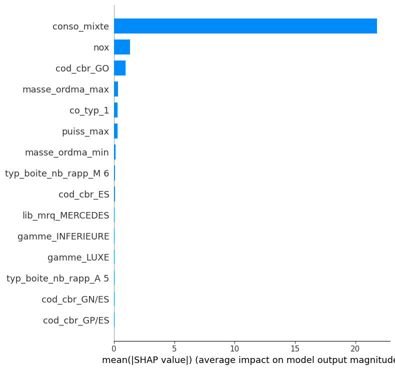

# Prédiction des émissions de CO₂ des véhicules commercialisés en France

## Projet Data Scientist — Liora (anciennement DataScientest)

**Formation :** Data Scientist – Liora (anciennement DataScientest)

**Projet :** Émissions de CO₂ des véhicules commercialisés en France

**Groupe :**
- Larissa Varnakova
- Aziz Diallo

**Mentor :** Nicolas Mormiche

**Date :** Septembre 2026

---

# Résumé

Ce projet de Data Science porte sur l’analyse et la prédiction des émissions de CO₂ des véhicules commercialisés en France à partir de leurs caractéristiques techniques et environnementales. Le jeu de données étudié regroupe 55 044 observations et 30 variables relatives notamment à la motorisation, à la puissance, à la masse, à la consommation de carburant et aux émissions de polluants.

Une première phase d’analyse exploratoire a permis d’évaluer la qualité des données, d’étudier les distributions et d’identifier les principales relations entre les variables. Les analyses graphiques et statistiques mettent notamment en évidence une forte association entre les émissions de CO₂ et la consommation de carburant, ainsi que l’influence de plusieurs caractéristiques telles que la masse, le type de carburant, la carrosserie, la gamme et l’hybridation.

Le prétraitement a ensuite consisté à nettoyer les données, traiter les valeurs manquantes, évaluer des variables dérivées, analyser les valeurs aberrantes, sélectionner les variables pertinentes et encoder les variables catégorielles. Une attention particulière a été portée à la prévention des fuites d’information, notamment en réalisant la séparation entre les jeux d’entraînement et de test avant les opérations d’imputation et d’encodage.

Ces étapes ont permis d’obtenir des jeux de données cohérents, complets et exploitables pour la phase de modélisation. Plusieurs modèles de régression ont ensuite été entraînés et comparés. XGBoost est retenu comme modèle de référence avec un **R² de 0,9993** et un **RMSE de 0,8950 g/km** sur le jeu de test. La validation croisée confirme la stabilité de ses performances.

Enfin, l’analyse SHAP met en évidence le rôle prépondérant de la consommation mixte dans les prédictions du modèle, devant les autres caractéristiques techniques et certaines informations liées au carburant. Ces résultats prolongent les constats issus de l’analyse exploratoire et permettent de répondre aux deux dimensions de la problématique : identifier les principaux facteurs associés aux émissions de CO₂ et construire un modèle capable de les prédire.

---

# Sommaire

1. Introduction

2. Contexte du projet
   - 2.1 Contexte métier
   - 2.2 Contexte scientifique et technique
   - 2.3 Problématique
   - 2.4 Objectifs du projet

3. Présentation des données
   - 3.1 Origine des données
   - 3.2 Description du jeu de données
   - 3.3 Variable cible
   - 3.4 Variables explicatives
   - 3.5 Synthèse

4. Analyse exploratoire des données (EDA)
   - 4.1 Qualité des données
   - 4.2 Analyse descriptive et distributions
   - 4.3 Analyse graphique
   - 4.4 Corrélations
   - 4.5 Analyses statistiques
   - 4.6 Conclusions de l'EDA

5. Prétraitement et Feature Engineering
   - 5.1 Nettoyage des données
   - 5.2 Séparation Train/Test
   - 5.3 Traitement des valeurs manquantes
   - 5.4 Feature Engineering
   - 5.5 Détection et traitement des valeurs aberrantes
   - 5.6 Sélection des variables
   - 5.7 Encodage des variables catégorielles
   - 5.8 Préparation des données pour la modélisation
   - 5.9 Synthèse du prétraitement

6. Modélisation

7. Comparaison globale des modèles

8. Interprétation du modèle retenu avec SHAP

9. Conclusion générale de la modélisation

10. Difficultés rencontrées

11. Conclusion générale du projet

12. Perspectives d'évolution

Bibliographie

Annexes

---

# 1. Introduction

La réduction des émissions de gaz à effet de serre constitue aujourd'hui un enjeu majeur pour le secteur des transports. En France, les véhicules particuliers et utilitaires représentent une part importante des émissions de dioxyde de carbone (CO₂), ce qui conduit les pouvoirs publics et les constructeurs automobiles à renforcer les politiques de réduction de l'impact environnemental des véhicules.

Dans ce contexte, l'analyse des données relatives aux caractéristiques techniques des véhicules permet de mieux comprendre les facteurs influençant les émissions de CO₂. L'identification de ces facteurs constitue une étape essentielle avant la mise en œuvre de modèles prédictifs capables d'estimer les émissions d'un véhicule à partir de ses caractéristiques.

Ce projet s'inscrit dans le cadre de la formation **Data Scientist** de **Liora (anciennement DataScientest)**. Il repose sur l'étude d'un jeu de données regroupant les caractéristiques techniques de véhicules commercialisés en France ainsi que leurs émissions de CO₂. L'objectif est de conduire une démarche complète d'analyse, d'exploration et de préparation des données en vue de leur exploitation par des modèles de Machine Learning.

Ce rapport présente la démarche suivie tout au long du projet, depuis la compréhension des données jusqu'à la modélisation et à l'interprétation des résultats. Après une présentation du jeu de données, une analyse exploratoire est menée afin d'en comprendre la structure, d'identifier les principales relations entre les variables et de mettre en évidence les caractéristiques les plus influentes. Les opérations de prétraitement sont ensuite détaillées et justifiées, avant de présenter les modèles entraînés, leur comparaison et l'interprétation du modèle retenu.

# 2. Contexte du projet

## 2.1 Contexte métier

La réduction des émissions de gaz à effet de serre constitue un enjeu majeur pour le secteur des transports. En France, les véhicules routiers représentent une part importante des émissions de CO₂, ce qui conduit les pouvoirs publics et les constructeurs automobiles à renforcer les politiques visant à réduire leur impact environnemental.

Les réglementations européennes imposent des objectifs de plus en plus exigeants en matière d'émissions de CO₂. Une meilleure compréhension des facteurs influençant ces émissions permet aux constructeurs de développer des véhicules plus performants sur le plan environnemental, d'anticiper les contraintes réglementaires, de limiter les pénalités financières et d'accompagner les consommateurs dans le choix de véhicules moins polluants.

## 2.2 Contexte scientifique et technique

Les émissions de CO₂ dépendent de nombreuses caractéristiques techniques des véhicules, telles que la consommation de carburant, la puissance, la masse, le type de carburant ou encore l'hybridation. L'analyse de ces variables permet d'identifier les facteurs les plus influents et de mieux comprendre les mécanismes expliquant les différences d'émissions observées entre les véhicules commercialisés en France.

Ce projet s'inscrit dans une démarche de Data Science visant à préparer un jeu de données destiné à la modélisation prédictive. Il mobilise les principales étapes d'un projet de Machine Learning : exploration des données, traitement des valeurs manquantes, feature engineering, sélection des variables, encodage des variables catégorielles et préparation des jeux d'entraînement et de test. L'objectif est de construire un jeu de données fiable et directement exploitable par les modèles de prédiction.

## 2.3 Problématique

Les émissions de CO₂ d'un véhicule dépendent de nombreux paramètres techniques, tels que la motorisation, la puissance, la masse, le type de carburant ou encore la consommation. Identifier les variables les plus influentes constitue une étape indispensable avant la mise en œuvre d'un modèle prédictif fiable.

La problématique retenue dans ce projet est donc la suivante :

**Quels sont les principaux facteurs influençant les émissions de CO₂ des véhicules commercialisés en France et comment exploiter ces informations pour construire un modèle de Machine Learning capable de prédire ces émissions ?**

## 2.4 Objectifs du projet

L'objectif principal de ce projet est d'analyser les facteurs associés aux émissions de CO₂ et de construire une démarche de Machine Learning permettant de prédire ces émissions à partir des caractéristiques des véhicules.

Pour atteindre cet objectif, plusieurs étapes ont été réalisées :

- comprendre la structure du jeu de données ;
- évaluer la qualité des données et identifier les éventuelles anomalies ;
- analyser les relations entre les variables grâce à des méthodes statistiques et des visualisations adaptées ;
- mettre en œuvre un prétraitement rigoureux des données (traitement des valeurs manquantes, gestion des variables, encodage et préparation des jeux d'entraînement et de test) ;
- préparer un jeu de données directement exploitable par des modèles de Machine Learning ;
- entraîner, comparer et interpréter plusieurs modèles de régression afin d'évaluer leur capacité à prédire les émissions de CO₂.

### Synthèse

Ce chapitre définit le cadre du projet et les objectifs poursuivis. L'étude vise à identifier les principaux facteurs associés aux émissions de CO₂, à préparer un jeu de données de qualité et à disposer d'une base méthodologique adaptée à la modélisation prédictive.

# 3. Présentation des données

## 3.1 Origine des données

Le jeu de données utilisé dans ce projet recense les caractéristiques techniques et environnementales des véhicules commercialisés en France en 2014. Il est publié par l’ADEME sur la plateforme data.gouv.fr. L’ADEME acquiert ces données auprès de l’UTAC (Union Technique de l’Automobile, du Motocycle et du Cycle), chargée de l’homologation des véhicules avant leur mise en vente.

Les données regroupent notamment des informations relatives aux émissions de CO₂, à la consommation de carburant, aux caractéristiques des motorisations ainsi qu’aux principaux polluants réglementés.

Ces données constituent une base pertinente pour analyser les caractéristiques associées aux émissions de CO₂ des véhicules et construire des modèles prédictifs, conformément à la problématique étudiée dans ce projet.

## 3.2 Description du jeu de données

Le jeu de données est composé d'observations correspondant à des véhicules commercialisés en France en 2014. Chaque ligne représente un véhicule et chaque colonne décrit une caractéristique technique ou environnementale.

Les variables couvrent notamment :

- les informations d'identification des véhicules ;
- les caractéristiques techniques (puissance, cylindrée, masse, type de carburant, transmission, etc.) ;
- les consommations de carburant ;
- les émissions de CO₂ ;
- les émissions des principaux polluants atmosphériques.

La variable cible retenue pour ce projet est **CO₂**, exprimée en grammes par kilomètre (g/km).

## 3.3 Variable cible

L'objectif de la modélisation est de prédire les émissions de CO₂ d'un véhicule à partir de ses caractéristiques.

Cette variable quantitative constitue donc la variable cible de l'ensemble des analyses. Les étapes d'exploration et de prétraitement visent à identifier les variables pertinentes et à préparer un jeu de données de qualité pour l'entraînement et l'évaluation des modèles de Machine Learning.

## 3.4 Variables explicatives

Les variables explicatives disponibles décrivent plusieurs dimensions des véhicules : leurs caractéristiques techniques, leur motorisation, leur masse, leur puissance, leur consommation de carburant, leur type de transmission ainsi que certaines caractéristiques environnementales.

Au cours de l'analyse exploratoire et du prétraitement, ces variables sont étudiées afin d'évaluer leur qualité, leur relation avec la variable cible, leur éventuelle redondance et leur pertinence pour la modélisation. Certaines variables sont conservées directement, tandis que d'autres sont supprimées ou transformées selon les résultats des analyses.

## 3.5 Synthèse

Le jeu de données retenu offre une base d'analyse complète pour étudier les émissions de CO₂ des véhicules commercialisés en France. La diversité des variables disponibles permet d'aborder la problématique sous différents angles et constitue un support solide pour les analyses exploratoires ainsi que pour la phase de modélisation.

# 4. Analyse exploratoire des données (EDA)

L'analyse exploratoire constitue une étape essentielle de tout projet de Data Science. Elle permet de comprendre la structure du jeu de données, d'évaluer sa qualité, d'identifier d'éventuelles anomalies et de mettre en évidence les premières relations entre les variables.

Cette phase conditionne l'ensemble des traitements réalisés par la suite. Elle permet notamment d'orienter les choix de prétraitement, de sélectionner les variables les plus pertinentes et de préparer les données en vue de leur modélisation.

## 4.1 Qualité des données

La première étape de l'analyse exploratoire a consisté à examiner la structure générale du jeu de données afin d'en évaluer la qualité et la cohérence.

Le jeu de données est composé de **55 044 observations** décrites par **30 variables**. Il regroupe des informations relatives aux caractéristiques techniques des véhicules, à leur motorisation, à leur consommation de carburant ainsi qu'à leurs émissions de CO₂ et d'autres polluants réglementés.

L'examen des types de variables met en évidence une majorité de variables catégorielles (chaînes de caractères) décrivant notamment les marques, les modèles, les carburants ou les transmissions, ainsi que plusieurs variables numériques correspondant aux caractéristiques techniques et environnementales des véhicules.

L'analyse des valeurs manquantes révèle que la majorité des variables sont complètes. En revanche, certaines variables présentent un taux important de valeurs manquantes. Les colonnes `Unnamed: 26` à `Unnamed: 29` sont entièrement vides (100 % de valeurs manquantes) et ne contiennent aucune information exploitable. La variable `date_maj` présente plus de **94 %** de valeurs manquantes, tandis que les variables `hc` et `hcnox` affichent respectivement environ **82 %** et **18 %** de données absentes.

À l'inverse, les variables directement liées à la problématique du projet présentent un très faible taux de valeurs manquantes. Les variables `ptcl`, `nox` et `co_typ_1`, qui seront conservées pour la suite des analyses, comportent moins de **5 %** de valeurs manquantes. Elles pourront donc être traitées lors de la phase de prétraitement sans dégrader significativement la qualité du jeu de données.

Cette première analyse confirme que le jeu de données est globalement de bonne qualité et qu'il est adapté à une démarche de modélisation après un prétraitement ciblé des variables concernées.

### Synthèse

L'évaluation de la qualité des données montre que le jeu de données est suffisamment fiable pour poursuivre les analyses. Les quelques anomalies identifiées concernent principalement des variables peu informatives ou fortement incomplètes, dont le traitement sera réalisé lors de la phase de prétraitement afin de disposer d'un jeu de données cohérent pour la modélisation.

## 4.2 Analyse descriptive et distributions

Après avoir vérifié la qualité générale du jeu de données, une analyse descriptive a été réalisée afin de mieux comprendre les caractéristiques des véhicules étudiés.

Comme l'illustre la **Figure 1**, l'examen des statistiques descriptives met en évidence une forte hétérogénéité des véhicules commercialisés en France en 2014. Les variables quantitatives, telles que la puissance du moteur, la cylindrée, la masse, la consommation de carburant ou encore les émissions de CO₂, présentent une dispersion importante, traduisant la diversité des modèles présents dans le jeu de données.

**Figure 1 – Distribution des émissions de CO₂ des véhicules du jeu de données.**

L'analyse de la variable cible montre que les émissions de CO₂ couvrent une plage de valeurs étendue, reflétant la coexistence de véhicules faiblement émetteurs et de véhicules plus énergivores. Cette variabilité constitue un point favorable pour la phase de modélisation, puisqu'elle permettra aux modèles d'apprendre sur un ensemble diversifié de situations.

Les statistiques descriptives mettent également en évidence la présence de valeurs extrêmes pour certaines variables techniques. Une analyse spécifique des valeurs aberrantes sera réalisée lors de la phase de prétraitement afin de déterminer si ces observations correspondent à de véritables véhicules atypiques ou à d'éventuelles anomalies.

Enfin, l'analyse des variables catégorielles révèle une répartition déséquilibrée entre certaines modalités. Les motorisations essence et diesel sont largement majoritaires, tandis que les motorisations hybrides et électriques sont présentes en effectifs beaucoup plus faibles, ce qui est cohérent avec le marché automobile français en 2014.

### Synthèse

L'analyse descriptive confirme la grande diversité des véhicules présents dans le jeu de données, tant en termes de caractéristiques techniques que d'émissions de CO₂. Cette variabilité constitue un contexte favorable pour approfondir les analyses et identifier les variables les plus étroitement liées aux émissions de CO₂.

## 4.3 Analyse graphique

Les visualisations réalisées au cours de l'analyse exploratoire ont permis de compléter les statistiques descriptives en mettant en évidence plusieurs relations importantes entre les caractéristiques techniques des véhicules et leurs émissions de CO₂.

L'étude de la distribution des émissions de CO₂ montre une forte variabilité des niveaux d'émission entre les véhicules commercialisés en France en 2014. Cette dispersion confirme l'intérêt de rechercher les variables les plus explicatives afin d'améliorer les performances des modèles prédictifs.

Comme l'illustre la **Figure 2**, la consommation de carburant présente une relation positive très marquée avec les émissions de CO₂. Une augmentation de la consommation s'accompagne systématiquement d'une augmentation des émissions. Cette tendance est particulièrement nette pour la consommation mixte, qui apparaît comme le meilleur indicateur des émissions de CO₂ parmi les différentes mesures de consommation. Ce résultat constitue l'un des principaux enseignements de l'analyse exploratoire et justifiera les choix réalisés lors de la phase de sélection des variables.

**Figure 2 – Relation entre la consommation mixte de carburant et les émissions de CO₂.**

Comme l'illustre la **Figure 3**, les émissions de CO₂ varient sensiblement selon le type de carburant. Les véhicules hybrides présentent globalement les niveaux d'émissions les plus faibles, tandis que les motorisations essence et diesel affichent des émissions plus élevées ainsi qu'une plus grande dispersion.

**Figure 3 – Distribution des émissions de CO₂ selon le type de carburant.**

La **Figure 3** met également en évidence une dispersion plus importante des émissions pour les motorisations essence et diesel. Les motorisations hybrides apparaissent plus homogènes et présentent globalement des niveaux d'émissions plus faibles.

Enfin, l'analyse des corrélations confirme que les variables liées à la consommation de carburant figurent parmi les meilleurs indicateurs des émissions de CO₂. À l'inverse, certaines variables techniques présentent une influence beaucoup plus limitée et seront réévaluées lors de la phase de sélection des variables.

### Synthèse

Les analyses graphiques mettent en évidence des relations claires entre les caractéristiques des véhicules et leurs émissions de CO₂. La consommation mixte apparaît comme le facteur le plus étroitement associé aux émissions, tandis que le type de carburant contribue également à expliquer les différences observées entre les véhicules. Ces constats seront vérifiés et quantifiés à l'aide des analyses statistiques présentées dans le chapitre suivant.

## 4.4 Corrélations

L'étude des corrélations a permis d'identifier les variables quantitatives les plus fortement associées aux émissions de CO₂.

Comme l'illustre la **Figure 4**, la matrice de corrélation met en évidence une forte relation positive entre les émissions de CO₂ et les différentes mesures de consommation de carburant. La consommation mixte (`conso_mixte`) présente la corrélation la plus élevée avec les émissions de CO₂ (≈ 0,97), suivie des consommations urbaine (`conso_urb`) et extra-urbaine (`conso_exurb`).

**Figure 4 – Matrice de corrélation des principales variables quantitatives.**

Les variables relatives à la masse du véhicule présentent également des corrélations positives importantes avec les émissions de CO₂. À l'inverse, certaines variables techniques montrent des coefficients de corrélation plus faibles, traduisant une influence plus limitée sur les émissions.

Les coefficients de Pearson et de Spearman ont permis de confirmer ces résultats. Malgré des approches différentes (relation linéaire pour Pearson et relation monotone pour Spearman), les deux méthodes conduisent aux mêmes conclusions générales concernant les variables les plus influentes.

Ces résultats montrent que les variables liées à la consommation constituent les meilleurs indicateurs des émissions de CO₂. Ces observations ont directement guidé les choix réalisés lors de la phase de prétraitement, notamment la sélection des variables conservées pour la modélisation.

### Synthèse

Les analyses de corrélation confirment que les variables liées à la consommation de carburant sont les plus fortement associées aux émissions de CO₂. La masse du véhicule présente également une relation importante, tandis que les autres variables quantitatives exercent une influence plus modérée. Ces résultats constituent un premier appui objectif pour la sélection des variables en vue de la modélisation.

## 4.5 Analyses statistiques

### Analyse de variance (ANOVA)

Afin d'évaluer les différences d'émissions de CO₂ associées à plusieurs variables catégorielles, des analyses de variance (ANOVA) ont été réalisées.

Une première ANOVA a porté sur le type de carburant. Les résultats mettent en évidence des différences statistiquement significatives entre les différentes motorisations. Les émissions moyennes de CO₂ varient selon le carburant utilisé, confirmant que cette variable constitue un facteur explicatif majeur des émissions des véhicules.

Une deuxième analyse a été réalisée selon le type de carrosserie. Les résultats montrent également des différences significatives entre les différentes catégories de véhicules. Certaines carrosseries présentent des niveaux d'émissions moyens plus élevés que d'autres, traduisant des usages et des caractéristiques techniques différents.

Enfin, une troisième ANOVA a été menée selon la gamme des véhicules. Là encore, les différences observées entre les groupes sont statistiquement significatives. Les véhicules appartenant aux gammes supérieures présentent généralement des émissions de CO₂ plus importantes, ce qui s'explique notamment par une masse et une puissance plus élevées.

L'ensemble de ces résultats confirme que les variables catégorielles étudiées sont associées à des différences significatives d'émissions de CO₂. Elles devront donc être prises en compte lors de la phase de modélisation.

### Synthèse

Les analyses de variance montrent que le type de carburant, la carrosserie et la gamme sont associés à des différences significatives d'émissions de CO₂ entre les véhicules. Ces résultats confirment que ces variables catégorielles apportent une information pertinente pour expliquer la variabilité des émissions et devront être prises en compte lors de la phase de modélisation.

### Tests de Student

Un test de Student a été réalisé afin de comparer les émissions moyennes de CO₂ entre les véhicules hybrides et les véhicules non hybrides.

Comme l'illustre la **Figure 5**, les véhicules hybrides présentent des émissions de CO₂ globalement plus faibles que les véhicules non hybrides. Cette différence visuelle suggère que les deux groupes ne suivent pas la même distribution, ce qui justifie la réalisation d'un test de Student afin de déterminer si cet écart est statistiquement significatif.

**Figure 5 – Distribution des émissions de CO₂ selon le type d'hybridation des véhicules.**

Les résultats du test mettent en évidence une différence statistiquement significative entre les deux groupes. Les véhicules hybrides présentent des émissions moyennes de CO₂ significativement plus faibles que les véhicules non hybrides. Ce résultat confirme les observations réalisées lors de l'analyse exploratoire et souligne l'impact du type d'hybridation sur les émissions de CO₂.

Au-delà de son intérêt statistique, ce résultat est cohérent avec les caractéristiques techniques des véhicules hybrides, conçus pour réduire la consommation de carburant et, par conséquent, les émissions de dioxyde de carbone.

### Synthèse

Le test de Student confirme que les véhicules hybrides émettent significativement moins de CO₂ que les véhicules non hybrides. Ce résultat confirme les observations issues des analyses graphiques et met en évidence l'influence du type d'hybridation sur les émissions des véhicules.

## 4.6 Conclusions de l'EDA

Les analyses statistiques ont permis de confirmer, de manière objective, les principales relations mises en évidence lors de l'analyse exploratoire. Elles montrent que les émissions de CO₂ dépendent à la fois de caractéristiques quantitatives, telles que la consommation de carburant et la masse du véhicule, et de caractéristiques catégorielles comme le type de carburant, la carrosserie, la gamme ou l'hybridation.

Ces résultats fournissent une base solide pour engager les différentes étapes du prétraitement et guider la sélection des variables utilisées lors de la modélisation.

# 5. Prétraitement et Feature Engineering

Le prétraitement constitue une étape essentielle d'un projet de Machine Learning. Son objectif est de transformer le jeu de données brut en un jeu de données fiable, cohérent et directement exploitable par les algorithmes de modélisation.

Les choix réalisés au cours de cette étape reposent sur les conclusions de l'analyse exploratoire et des analyses statistiques présentées dans les chapitres précédents. Chaque transformation a été réalisée dans le but d'améliorer la qualité des données tout en limitant les risques de biais ou de fuite d'information (*data leakage*).

Le prétraitement a été réalisé selon une démarche progressive comprenant le nettoyage des données, le traitement des valeurs manquantes, le **feature engineering**, la **sélection des variables**, l'encodage des variables catégorielles ainsi que la préparation des jeux de données destinés à la phase de modélisation.

## 5.1 Nettoyage des données

Avant toute transformation, le jeu de données a fait l'objet d'un nettoyage afin de supprimer les informations inutiles ou non exploitables pour la modélisation.

Les premières analyses ont mis en évidence plusieurs colonnes entièrement vides (`Unnamed: 26` à `Unnamed: 29`) ainsi qu'une variable (`date_maj`) présentant une proportion très importante de valeurs manquantes. Ces variables n'apportant aucune information pertinente pour l'étude, elles ont été supprimées.

Certaines variables descriptives ont également été écartées au cours du prétraitement. Bien qu'utiles pour l'identification des véhicules, elles n'apportaient pas de pouvoir explicatif direct pour la prédiction des émissions de CO₂ et risquaient d'augmenter inutilement la complexité du modèle.

Enfin, la variable cible (`co2`) a été séparée des variables explicatives avant le début des traitements de prétraitement. Cette séparation garantit que les transformations appliquées aux variables explicatives ne modifient jamais la variable à prédire.

### Synthèse

Le nettoyage des données a permis de conserver uniquement les informations pertinentes pour la modélisation et d'écarter les variables susceptibles d'apporter du bruit ou de biaiser les analyses. Ce nettoyage permet ainsi de disposer d'un jeu de données cohérent et pertinent avant de poursuivre les différentes étapes du prétraitement.

## 5.2 Séparation Train/Test

Avant les opérations d'imputation et d'encodage, les données ont été séparées en un jeu d'entraînement et un jeu de test. Cette organisation permet d'évaluer les modèles sur des observations qui n'ont pas été utilisées pour ajuster les transformations ni pour entraîner les algorithmes.

Les statistiques nécessaires au prétraitement sont calculées uniquement à partir du jeu d'entraînement, puis appliquées au jeu de test. Cette démarche limite le risque de fuite d'information (*data leakage*) et garantit une évaluation plus représentative de la capacité de généralisation des modèles.

### Synthèse

La séparation Train/Test constitue une étape structurante du pipeline. Réalisée avant l'imputation et l'encodage, elle garantit que les informations issues du jeu de test n'interviennent pas dans l'apprentissage des transformations appliquées aux données.

## 5.3 Traitement des valeurs manquantes

L'analyse exploratoire a mis en évidence la présence de valeurs manquantes sur les variables `ptcl`, `nox` et `co_typ_1`. Leur faible taux de données manquantes (inférieur à 5 %) permettait d'envisager une imputation tout en conservant l'ensemble des observations du jeu de données.

Avant de retenir une stratégie d'imputation, plusieurs approches ont été étudiées. Une imputation par marque de véhicule a notamment été envisagée. Cette solution n'a toutefois pas été retenue en raison de la forte disparité des effectifs entre les marques, certaines étant représentées par un nombre très limité de véhicules. Une telle approche aurait conduit à calculer des médianes sur des échantillons insuffisamment représentatifs.

L'analyse des médianes par type de carburant a ensuite montré que les variables `nox` et `co_typ_1` présentaient des différences importantes entre les motorisations essence et diesel. Cette caractéristique justifiait une imputation tenant compte du type de carburant.

Les stratégies retenues sont donc les suivantes :

- **`ptcl`** : imputation par la médiane globale calculée sur le jeu d'entraînement ;
- **`nox`** : imputation par la médiane du type de carburant (`cod_cbr`), avec recours à la médiane globale lorsque la catégorie ne permettait pas de calculer une médiane ;
- **`co_typ_1`** : même stratégie que pour `nox`, fondée sur la médiane par type de carburant complétée, si nécessaire, par une médiane globale.

Conformément aux bonnes pratiques du Machine Learning, toutes les statistiques d'imputation ont été calculées exclusivement sur le jeu d'entraînement (`X_train`), puis appliquées à la fois au jeu d'entraînement et au jeu de test. Cette démarche garantit l'absence de fuite d'information (*data leakage*) entre les deux jeux de données.

La vérification réalisée après l'imputation montre qu'aucune valeur manquante ne subsiste pour les variables `ptcl`, `nox` et `co_typ_1`, confirmant la bonne application du prétraitement.

### Synthèse

Le traitement des valeurs manquantes repose sur une stratégie adaptée aux caractéristiques de chaque variable. L'imputation par la médiane globale ou par la médiane conditionnelle selon le type de carburant permet de conserver l'ensemble des observations tout en limitant les risques de biais et de fuite d'information. Les données sont désormais complètes pour les variables concernées.

## 5.4 Feature Engineering

Dans le cadre du prétraitement, plusieurs variables dérivées ont été envisagées afin d'améliorer le pouvoir explicatif du jeu de données.

Une première variable a été créée en calculant le rapport entre la puissance maximale du moteur (`puiss_max`) et la masse minimale du véhicule (`masse_ordma_min`). L'objectif était de représenter le niveau de puissance rapporté au poids du véhicule, un indicateur susceptible d'influencer les émissions de CO₂.

L'analyse de cette nouvelle variable montre toutefois une corrélation linéaire faible avec les émissions de CO₂ (≈ 0,089). Ce résultat indique que ce ratio n'apporte pas d'information complémentaire significative par rapport aux variables déjà présentes dans le jeu de données. Cette variable a donc été supprimée.

Une seconde variable, fondée sur le rapport entre la puissance maximale et la masse maximale du véhicule (`masse_ordma_max`), a également été évaluée. Là encore, la corrélation observée avec les émissions de CO₂ est restée très faible (≈ 0,054), confirmant l'absence d'apport explicatif dans cette première approche.

Ces essais illustrent une démarche de feature engineering consistant à créer puis à évaluer objectivement de nouvelles variables avant de décider de leur conservation. Dans notre cas, les deux variables créées n'apportaient pas d'amélioration significative et ont donc été retirées du jeu de données afin de conserver un prétraitement simple et pertinent.

### Synthèse

Les variables créées lors de cette phase de feature engineering ont été évaluées avant leur éventuelle intégration au jeu de données. Les deux ratios puissance/masse présentant un faible pouvoir explicatif vis-à-vis des émissions de CO₂, ils n'ont pas été conservés. Cette étape confirme que la création de nouvelles variables doit être guidée par leur apport réel à la modélisation.

## 5.5 Détection et traitement des valeurs aberrantes

La présence de valeurs aberrantes a été étudiée sur les principales variables quantitatives du jeu de données, notamment les émissions de CO₂, les consommations de carburant, la puissance du moteur et la masse des véhicules.

Des boxplots ont été réalisés afin d'identifier les observations situées à l'extérieur des intervalles habituels de chaque distribution. Ces visualisations mettent effectivement en évidence plusieurs valeurs extrêmes.

Une analyse de ces observations montre toutefois qu'elles correspondent à des véhicules réels présentant des caractéristiques techniques particulières, tels que des véhicules très puissants, très lourds ou à forte consommation. Aucune valeur manifestement incohérente ou résultant d'une erreur de saisie n'a été identifiée.

Dans ce contexte, le choix a été fait de conserver l'ensemble des observations. La suppression de ces véhicules aurait conduit à réduire artificiellement la variabilité du jeu de données et à écarter des situations pourtant représentatives du marché automobile.

### Synthèse

L'analyse des valeurs aberrantes montre que les observations extrêmes correspondent à des véhicules réels et non à des erreurs de mesure ou de saisie. Leur conservation permet de préserver la représentativité du jeu de données et de maintenir la variabilité nécessaire à la phase de modélisation.

## 5.6 Sélection des variables

Après le traitement des valeurs manquantes, le feature engineering et l'analyse des valeurs aberrantes, une étape de sélection des variables a été réalisée afin d'identifier les variables les plus pertinentes pour la modélisation.

Cette analyse s'appuie sur les résultats de l'analyse exploratoire, les corrélations observées entre les variables ainsi que sur les connaissances métier relatives aux caractéristiques techniques des véhicules. L'objectif est de limiter la redondance entre les variables explicatives, de réduire la complexité du modèle et de conserver uniquement les informations les plus pertinentes pour prédire les émissions de CO₂.

Les variables numériques ont tout d'abord été étudiées. La variable `champ_v9`, correspondant à une référence réglementaire d'homologation, a été supprimée en raison de son faible intérêt pour la modélisation. La variable `puiss_admin_98` a également été écartée, sa très forte corrélation avec `puiss_max` (0,973) traduisant une redondance importante. De même, les variables `conso_urb` et `conso_exurb` ont été supprimées au profit de `conso_mixte`, plus représentative de la consommation globale du véhicule et fortement corrélée aux émissions de CO₂. En revanche, les variables `masse_ordma_min` et `masse_ordma_max` ont été conservées, leur corrélation (0,795) restant insuffisante pour justifier la suppression de l'une d'elles.

Les variables textuelles ont ensuite été analysées. Les variables `cnit`, `tvv`, `dscom`, `lib_mod` et `lib_mod_doss` n'ont pas été retenues en raison de leur forte cardinalité, de leur nature technique ou de leur faible valeur ajoutée pour la modélisation. À l'inverse, les variables `lib_mrq`, `cod_cbr`, `hybride`, `Carrosserie`, `gamme` et `typ_boite_nb_rapp` ont été conservées afin d'être encodées avant la phase de modélisation.

### Synthèse

La sélection des variables a permis de supprimer les variables jugées redondantes ou peu pertinentes tout en conservant les caractéristiques les plus informatives du jeu de données. Cette étape contribue à simplifier le jeu de données, à limiter la redondance entre les variables explicatives et à préparer un encodage pertinent des variables catégorielles.

## 5.7 Encodage des variables catégorielles

À l'issue de la sélection des variables, les variables catégorielles retenues ont été transformées afin d'être exploitables par les algorithmes de Machine Learning.

Les variables conservées pour cette étape sont :

- `cod_cbr` (type de carburant) ;
- `hybride` ;
- `Carrosserie` ;
- `gamme` ;
- `lib_mrq` (marque du véhicule) ;
- `typ_boite_nb_rapp` (type de boîte de vitesses et nombre de rapports).

Les variables `cnit`, `tvv`, `dscom`, `lib_mod` et `lib_mod_doss` n'ont pas été encodées, car elles ont été écartées lors de l'étape de sélection des variables en raison de leur forte cardinalité, de leur nature technique ou de leur faible valeur ajoutée pour la modélisation.

L'encodage a été réalisé à l'aide de **OneHotEncoder** de la bibliothèque *scikit-learn*. Conformément aux bonnes pratiques du Machine Learning, l'encodeur a été ajusté uniquement sur le jeu d'entraînement (`X_train`), puis appliqué au jeu de test (`X_test`). Cette démarche permet d'éviter toute fuite d'information (*data leakage*).

Le paramètre `drop="first"` a été utilisé afin de supprimer une modalité de référence pour chaque variable catégorielle. Ce choix permet d'éviter une colinéarité parfaite entre les variables créées tout en conservant l'information utile à la modélisation.

Le paramètre `handle_unknown="ignore"` a également été retenu afin de garantir qu'une modalité absente du jeu d'entraînement mais présente dans le jeu de test puisse être traitée sans provoquer d'erreur lors de la transformation.

L'encodage des variables catégorielles retenues a ainsi permis de générer un ensemble de variables indicatrices directement exploitables par les modèles de Machine Learning.

### Synthèse

L'encodage des variables catégorielles a permis de transformer les variables qualitatives retenues en variables numériques tout en respectant les bonnes pratiques du Machine Learning. Réalisé après la sélection des variables et ajusté uniquement sur le jeu d'entraînement, il garantit une transformation cohérente des données avant leur utilisation par les modèles de prédiction.

## 5.8 Préparation des données pour la modélisation

La dernière étape du prétraitement a consisté à constituer les jeux de données définitifs utilisés lors de la phase de modélisation.

Conformément aux décisions prises lors de la sélection des variables, les variables numériques et textuelles jugées peu pertinentes ou redondantes ont été supprimées des jeux d'entraînement et de test avant l'encodage des variables catégorielles.

Les variables catégorielles retenues ont ensuite été transformées à l'aide d'un encodage One-Hot afin d'obtenir des jeux de données entièrement numériques.

Plusieurs contrôles ont ensuite été réalisés afin de vérifier la qualité des jeux de données obtenus. Les dimensions des jeux d'entraînement et de test ont été comparées afin de s'assurer de leur cohérence après l'ensemble des transformations. Les types des variables ont également été vérifiés pour confirmer que toutes les variables étaient désormais numériques.

Une dernière vérification a permis de confirmer l'absence de valeurs manquantes dans les jeux de données finaux. Enfin, un aperçu des premières observations a été réalisé afin de contrôler le bon déroulement de l'ensemble des étapes de prétraitement.

Ces différentes vérifications garantissent que les jeux de données sont complets, cohérents et directement exploitables pour entraîner et évaluer les modèles de Machine Learning.

### Synthèse

Les jeux d'entraînement et de test obtenus sont prêts pour la phase de modélisation. Les différentes étapes de prétraitement ont permis d'obtenir des jeux de données complets, cohérents et entièrement numériques, répondant aux exigences nécessaires à l'entraînement et à l'évaluation des modèles de Machine Learning.

## 5.9 Synthèse du prétraitement

Le prétraitement a permis de transformer le jeu de données initial en un ensemble de données fiable, cohérent et adapté à la phase de modélisation. Les différentes étapes mises en œuvre ont été guidées par les résultats de l'analyse exploratoire et des analyses statistiques, afin de conserver uniquement les informations les plus pertinentes.

Les jeux d'entraînement et de test obtenus sont complets, entièrement numériques et prêts à être utilisés pour entraîner et évaluer les modèles de prédiction des émissions de CO₂.

# 6. Modélisation

## 6.1 Objectif et protocole d'évaluation

À l'issue des étapes d'exploration et de prétraitement, les jeux de données utilisés pour la modélisation sont entièrement numériques et ne comportent plus de valeurs manquantes. Le jeu d'entraînement contient **44 008 observations et 91 variables**, tandis que le jeu de test contient **11 002 observations et 91 variables**.

L'objectif de cette phase est de construire plusieurs modèles de régression capables de prédire les émissions de CO₂ à partir des caractéristiques techniques et énergétiques des véhicules. Les modèles sont évalués principalement à l'aide de quatre métriques : la **MAE** (*Mean Absolute Error*), le **RMSE** (*Root Mean Squared Error*), le **R²** (coefficient de détermination) et la **MAPE** (*Mean Absolute Percentage Error*).

Plusieurs familles de modèles ont été étudiées afin de comparer des approches de complexité croissante : un modèle de référence, des modèles linéaires, un arbre de décision, des méthodes d'ensemble fondées sur les arbres et, enfin, un réseau de neurones.

## 6.2 Baseline : DummyRegressor

Un **DummyRegressor** a d'abord été utilisé comme modèle de référence. Il prédit systématiquement la moyenne de la variable cible et permet ainsi de disposer d'un niveau de performance minimal auquel comparer les autres modèles.

Les performances obtenues sont faibles : **MAE = 22,51 g/km**, **RMSE = 34,40 g/km**, **R² ≈ 0** et **MAPE = 0,1310**. Ce résultat confirme qu'une prédiction reposant uniquement sur la moyenne ne permet pas de représenter correctement la variabilité des émissions de CO₂.

Cette baseline constitue donc un point de comparaison utile pour mesurer l'apport réel des modèles de Machine Learning.

## 6.3 Modèles linéaires

### 6.3.1 Régression linéaire

La régression linéaire constitue la première approche supervisée testée. Malgré sa simplicité, elle obtient d'excellentes performances : **MAE = 1,10 g/km**, **RMSE = 1,80 g/km**, **R² = 0,9973** et **MAPE = 0,0061**.

Les scores R² obtenus sur les jeux d'entraînement (**0,9972**) et de test (**0,9973**) sont quasiment identiques. Cet écart très faible indique une bonne capacité de généralisation et ne met pas en évidence de surapprentissage.

L'analyse des valeurs réelles et prédites, des résidus et de la courbe d'apprentissage confirme la qualité de l'ajustement. Les prédictions sont très proches des valeurs observées et les résidus restent globalement centrés autour de zéro.

### 6.3.2 Régression Ridge

La régression Ridge introduit une régularisation L2 afin de limiter l'influence de coefficients trop importants. Elle obtient des performances très proches de celles de la régression linéaire : **MAE = 1,12 g/km**, **RMSE = 1,82 g/km**, **R² = 0,9972** et **MAPE = 0,0062**.

Les scores d'entraînement (**R² = 0,9971**) et de test (**R² = 0,9972**) restent très proches. La régularisation conserve donc une excellente capacité prédictive, sans amélioration significative par rapport à la régression linéaire simple.

### 6.3.3 Régression Lasso

La régression Lasso applique une régularisation L1, susceptible de réduire certains coefficients jusqu'à zéro. Ses performances restent bonnes mais sont inférieures à celles des deux modèles linéaires précédents : **MAE = 3,94 g/km**, **RMSE = 5,65 g/km**, **R² = 0,9730** et **MAPE = 0,0206**.

Les scores R² d'entraînement (**0,9710**) et de test (**0,9730**) restent cohérents, ce qui indique une bonne généralisation. En revanche, la pénalisation appliquée par Lasso réduit ici la précision des prédictions.

## 6.4 Arbre de décision

L'arbre de décision permet de modéliser des relations non linéaires entre les caractéristiques des véhicules et les émissions de CO₂. Il améliore nettement les performances des modèles linéaires, avec un **MAE d'environ 0,09 g/km**, un **RMSE de 1,43 g/km**, un **R² de 0,9983** et une **MAPE de 0,0006** lors de son évaluation.

Le score R² atteint **0,99999** sur le jeu d'entraînement contre **0,99827** sur le jeu de test. Le modèle reste donc très performant sur les données non vues, même si l'écart avec le score d'entraînement est plus marqué que pour les modèles linéaires.

Cette expérimentation montre l'intérêt des modèles à base d'arbres pour capturer les relations non linéaires présentes dans les données.

## 6.5 Random Forest

Le **Random Forest** agrège plusieurs arbres de décision entraînés sur des échantillons bootstrap. Cette méthode de bagging vise notamment à réduire la variance d'un arbre unique et à améliorer sa robustesse.

Le modèle obtient d'excellentes performances. Dans la comparaison finale, il atteint **MAE = 0,0994 g/km**, **RMSE = 1,0044 g/km**, **R² = 0,9991** et **MAPE = 0,0007**. Les scores d'entraînement (**R² = 0,9999**) et de test (**R² = 0,9991**) restent très proches.

Une optimisation avec **GridSearchCV** a également été réalisée. Les meilleurs paramètres identifiés correspondent à la configuration initiale : **100 arbres**, aucune limite de profondeur, `min_samples_split = 2` et `min_samples_leaf = 1`. Le score moyen obtenu en validation croisée est de **0,9987**.

L'optimisation ne modifie donc pas les performances du modèle, mais confirme que la configuration initiale est déjà adaptée au jeu de données.

## 6.6 XGBoost

Le modèle **XGBoost** repose sur le principe du boosting : les arbres sont construits de manière séquentielle, chaque nouvel arbre cherchant à corriger les erreurs des précédents.

Avec ses paramètres retenus, XGBoost obtient les meilleures performances globales de l'étude : **MAE = 0,2975 g/km**, **RMSE = 0,8950 g/km**, **R² = 0,9993** et **MAPE = 0,0017**.

Les scores R² sur les jeux d'entraînement (**0,9998**) et de test (**0,9993**) sont très proches, ce qui confirme une excellente capacité de généralisation.

**Figure 6 – Comparaison entre les valeurs réelles et les valeurs prédites par XGBoost.**

La quasi-totalité des observations se situe à proximité de la diagonale représentant une prédiction parfaite. Quelques écarts subsistent pour certaines valeurs élevées, mais ils restent limités au regard de l'ensemble des données.

Une optimisation avec **GridSearchCV** a également été testée. Le modèle optimisé obtient **MAE = 0,42 g/km**, **RMSE = 0,98 g/km**, **R² = 0,9992** et **MAPE = 0,0024**. Ces performances étant légèrement inférieures à celles du modèle initial, la version initiale de XGBoost est conservée comme modèle de référence.

## 6.7 LightGBM

Le modèle **LightGBM** constitue une autre approche de boosting fondée sur les arbres de décision. Avec ses paramètres par défaut, il obtient **MAE = 0,41 g/km**, **RMSE = 2,01 g/km**, **R² = 0,9966** et **MAPE = 0,0024**.

Une optimisation avec GridSearchCV a ensuite permis d'identifier la configuration suivante : `learning_rate = 0.1`, `max_depth = 8`, `n_estimators = 200` et `num_leaves = 31`. Le modèle optimisé atteint **MAE = 0,40 g/km**, **RMSE = 1,62 g/km**, **R² = 0,9978** et **MAPE = 0,0023**.

Contrairement aux résultats obtenus avec Random Forest et XGBoost, l'optimisation améliore ici les performances de LightGBM. Le modèle reste toutefois en retrait par rapport à XGBoost et Random Forest.

## 6.8 Expérimentations complémentaires

### 6.8.1 Transformation logarithmique de la variable cible

Une transformation logarithmique de la variable cible a été testée afin d'évaluer si elle permettait d'améliorer les performances des modèles linéaires.

Après retour à l'échelle d'origine, la régression linéaire obtient **R² = 0,9439**, Ridge **R² = 0,9432** et Lasso **R² = 0,5754**. Ces résultats sont inférieurs à ceux obtenus directement sur la variable cible initiale.

La transformation logarithmique n'apporte donc pas de gain dans le cadre de ce jeu de données et n'est pas retenue pour la suite.

### 6.8.2 Validation croisée

Une validation croisée a été réalisée afin d'évaluer la stabilité des principaux modèles d'ensemble sur plusieurs partitions des données.

XGBoost obtient un **R² moyen de 0,9994** avec un écart-type très faible, devant Random Forest (**R² moyen = 0,9992**) et LightGBM (**R² moyen = 0,9985**).

Ces résultats confirment la stabilité des performances observées sur le jeu de test et renforcent le choix de XGBoost comme modèle de référence.

### 6.8.3 Perceptron Multicouche (MLP)

Un **Perceptron Multicouche (MLP)** a également été expérimenté afin d'évaluer une approche de Deep Learning sur les mêmes données.

Le MLP obtient un **MAE de 1,1335 g/km**, un **RMSE de 1,6804 g/km**, un **R² de 0,9976** et une **MAPE de 0,0061**. Ces résultats montrent qu'un réseau de neurones simple est capable de modéliser efficacement les émissions de CO₂.

Le MLP présente notamment un **R² supérieur à ceux de la régression linéaire, de Ridge et de LightGBM**. Il reste toutefois en retrait par rapport aux modèles les plus performants de cette étude, notamment XGBoost et Random Forest.

Cette expérimentation montre que les approches de Deep Learning peuvent être envisagées pour ce type de problématique, même si, dans le cadre de cette étude, les meilleurs résultats restent obtenus par les méthodes d'ensemble fondées sur les arbres.

# 7. Comparaison globale des modèles

La comparaison finale permet de synthétiser les performances obtenues par les différentes approches sur le jeu de test.

| Modèle | MAE (g/km) | RMSE (g/km) | R² | MAPE |
|---|---:|---:|---:|---:|
| XGBoost | 0,2975 | 0,8950 | 0,9993 | 0,0017 |
| Random Forest | 0,0994 | 1,0044 | 0,9991 | 0,0007 |
| Arbre de décision | 0,0881 | 1,4307 | 0,9983 | 0,0006 |
| Régression linéaire | 1,1046 | 1,7987 | 0,9973 | 0,0061 |
| Ridge | 1,1243 | 1,8214 | 0,9972 | 0,0062 |
| LightGBM | 0,4116 | 2,0065 | 0,9966 | 0,0024 |
| Lasso | 3,9410 | 5,6517 | 0,9730 | 0,0206 |
| MLP   | 1,1335 | 1,6804 | 0,9976 | 0,0061
| DummyRegressor | 22,5123 | 34,3963 | ≈ 0 | 0,1310 |

L'ensemble des modèles supervisés surpasse très largement le **DummyRegressor**, ce qui confirme que les variables explicatives retenues contiennent une information importante pour prédire les émissions de CO₂.

**XGBoost** présente le **R² le plus élevé (0,9993)** ainsi que le **RMSE le plus faible (0,8950 g/km)**. L'**Arbre de décision** obtient pour sa part le **MAE et la MAPE les plus faibles**, avec respectivement **0,0881 g/km** et **0,0006**. Ces résultats montrent que les modèles se distinguent selon des métriques complémentaires.

La validation croisée confirme également la stabilité de **XGBoost**, avec un **R² moyen de 0,9994**. Au regard de l'ensemble de ces résultats, **XGBoost est retenu comme modèle principal de l'étude**.

# 8. Interprétation du modèle retenu avec SHAP

Les performances prédictives ne suffisent pas à elles seules à comprendre le fonctionnement d'un modèle. Une analyse d'interprétabilité a donc été réalisée avec **SHAP (SHapley Additive exPlanations)** afin de mesurer la contribution des différentes variables aux prédictions de XGBoost.

## 8.1 Graphique de synthèse

**Figure 7 – Graphique SHAP de synthèse du modèle XGBoost.**

L'analyse montre que **`conso_mixte`** est de très loin la variable la plus influente dans les prédictions du modèle. Les consommations élevées contribuent fortement à augmenter les émissions de CO₂ prédites, tandis que les faibles consommations contribuent à les diminuer.

Les variables **`nox`**, **`masse_ordma_max`**, **`puiss_max`** ainsi que certaines modalités liées au carburant interviennent également dans les prédictions, mais avec une influence nettement plus faible.

## 8.2 Importance globale des variables

**Figure 8 – Importance globale des variables selon les valeurs SHAP du modèle XGBoost.**

Le graphique d'importance globale confirme la prédominance de **`conso_mixte`**, dont la valeur SHAP moyenne est très supérieure à celle des autres variables. Les variables `nox`, `cod_cbr_GO`, `masse_ordma_max` et `puiss_max` forment un second groupe de variables explicatives.

Cette hiérarchie est cohérente avec les résultats de l'analyse exploratoire, qui avait déjà mis en évidence la forte relation entre la consommation mixte et les émissions de CO₂. L'analyse SHAP permet ainsi de relier les performances du modèle aux principaux facteurs utilisés pour produire ses prédictions.

# 9. Conclusion générale de la modélisation

La phase de modélisation a permis de comparer plusieurs familles de modèles, depuis une baseline très simple jusqu'aux méthodes d'ensemble et au Deep Learning.

Les modèles linéaires obtiennent déjà des performances très élevées, notamment la régression linéaire et Ridge. L'utilisation de modèles fondés sur les arbres améliore encore les résultats. Random Forest et XGBoost se distinguent particulièrement, tandis que LightGBM bénéficie d'une amélioration après optimisation de ses hyperparamètres.

Les expérimentations complémentaires permettent de consolider ces résultats. La transformation logarithmique de la cible n'améliore pas les performances des modèles linéaires. La validation croisée confirme en revanche la stabilité des méthodes d'ensemble, en particulier de XGBoost. Le MLP obtient également de très bonnes performances, avec un R² de 0,9976 et un RMSE de 1,6804 g/km, même s'il reste en retrait par rapport à XGBoost et Random Forest.

Au terme de cette comparaison, **XGBoost est retenu comme modèle de référence**. Il présente le R² le plus élevé (0,9993), le RMSE le plus faible (0,8950 g/km) et une excellente stabilité en validation croisée. L'analyse SHAP complète cette évaluation en permettant d'identifier les variables qui contribuent le plus à ses prédictions.

# 10. Difficultés rencontrées

Le projet a nécessité plusieurs choix méthodologiques afin de construire une démarche cohérente et d'éviter de retenir un modèle uniquement sur la base d'une première performance.

Une première difficulté a consisté à **comparer des modèles de nature très différente** à l'aide d'un protocole commun. L'utilisation systématique des mêmes métriques — MAE, RMSE, R² et MAPE — ainsi que du même jeu de test a permis de rendre les résultats comparables.

L'**optimisation des hyperparamètres** a également montré qu'une recherche plus complexe ne conduit pas nécessairement à de meilleures performances. Pour Random Forest, GridSearchCV retrouve les paramètres initiaux. Pour XGBoost, la configuration optimisée testée obtient même des résultats légèrement inférieurs au modèle de départ. À l'inverse, LightGBM bénéficie réellement de cette étape. Ces résultats ont conduit à conserver, pour chaque algorithme, la configuration offrant effectivement les meilleures performances observées.

La **validation des résultats** a constitué un autre point important. Les scores très élevés obtenus par plusieurs modèles ont nécessité de compléter l'évaluation sur le jeu de test par l'analyse des scores d'entraînement, des courbes d'apprentissage et une validation croisée. Cette démarche permet de vérifier que les performances ne reposent pas uniquement sur une partition particulière des données.

Enfin, certaines expérimentations n'ont pas apporté d'amélioration par rapport aux modèles les plus performants. La transformation logarithmique de la cible dégrade les performances des modèles linéaires. Le MLP obtient quant à lui de très bonnes performances, mais reste en retrait par rapport à XGBoost et Random Forest. Ces essais ont néanmoins permis de mieux délimiter les approches adaptées au jeu de données étudié.

# 11. Conclusion générale du projet

Ce projet a permis de mettre en œuvre une démarche complète de Data Science appliquée à la prédiction des émissions de CO₂ des véhicules commercialisés en France.

L'analyse exploratoire a d'abord permis de comprendre la structure et la qualité des données, d'étudier les distributions et de mettre en évidence les principales relations entre les caractéristiques des véhicules et leurs émissions. La consommation de carburant est apparue dès cette étape comme un facteur particulièrement lié aux émissions de CO₂.

Le prétraitement a ensuite permis de construire des jeux de données complets et exploitables pour la modélisation. Les valeurs manquantes ont été traitées, les variables peu pertinentes ou redondantes ont été étudiées, les variables catégorielles ont été encodées et la séparation entre les jeux d'entraînement et de test a été organisée de manière à limiter les risques de fuite d'information.

La phase de modélisation a montré que plusieurs approches permettent d'obtenir des performances élevées. Les méthodes d'ensemble fondées sur les arbres se distinguent particulièrement. XGBoost est finalement retenu comme modèle de référence avec un **R² de 0,9993** et un **RMSE de 0,8950 g/km** sur le jeu de test. La validation croisée confirme la stabilité de ses performances.

Enfin, l'analyse SHAP montre que la consommation mixte joue un rôle prépondérant dans les prédictions du modèle, devant les autres caractéristiques techniques et certaines informations liées au carburant. Cette interprétation prolonge les constats issus de l'analyse exploratoire, qui avait déjà mis en évidence l'association entre les émissions de CO₂ et la consommation, mais également le rôle de la masse, du type de carburant, de la carrosserie, de la gamme et de l'hybridation.

Les résultats obtenus permettent ainsi de répondre aux deux dimensions de la problématique initiale. D'une part, l'analyse exploratoire, les analyses statistiques et SHAP permettent d'identifier les principales caractéristiques associées aux émissions de CO₂ dans le jeu de données étudié. D'autre part, la comparaison des modèles montre qu'il est possible d'exploiter ces caractéristiques pour construire un modèle prédictif performant, XGBoost atteignant un **R² de 0,9993** et un **RMSE de 0,8950 g/km** sur le jeu de test.

Le projet aboutit ainsi à un pipeline complet allant de l'exploration des données à l'entraînement, à la comparaison et à l'interprétation des modèles. Le modèle XGBoost retenu a également été sauvegardé afin de pouvoir être réutilisé sans nécessiter un nouvel entraînement.

# 12. Perspectives d'évolution

Bien que les résultats obtenus soient très satisfaisants, plusieurs pistes d'amélioration ont été identifiées au cours du projet.

## 12.1 Généraliser le Target Encoding

Le **Target Encoding** a été testé en remplacement du One-Hot Encoding sur certaines variables catégorielles. Cette approche a permis de réduire significativement le nombre de variables créées tout en conservant des performances très proches de celles obtenues avec le One-Hot Encoding.

Une perspective intéressante consisterait à appliquer systématiquement le Target Encoding à l'ensemble des modèles afin d'évaluer son impact sur leurs performances, leur temps d'entraînement et leur capacité de généralisation.

## 12.2 Approfondir les architectures de Deep Learning

Le Perceptron Multicouche testé repose sur une architecture volontairement simple. L'exploration de réseaux plus profonds ainsi que l'utilisation de techniques telles que **Dropout**, **Batch Normalization** ou **EarlyStopping** pourraient permettre d'améliorer ses performances.

## 12.3 Poursuivre l'optimisation des hyperparamètres

Les modèles les plus performants pourraient faire l'objet d'une optimisation plus poussée à l'aide de méthodes avancées telles que l'optimisation bayésienne ou **Optuna**, afin d'explorer plus efficacement l'espace des hyperparamètres.

## 12.4 Explorer d'autres approches de Machine Learning

D'autres algorithmes pourraient également être évalués, notamment **CatBoost** ou **ExtraTrees**, afin de comparer leurs performances à celles des modèles déjà étudiés et de compléter l'analyse comparative.

Ces perspectives permettraient de prolonger le travail réalisé tout en conservant la démarche suivie dans le projet : tester les différentes approches, mesurer objectivement leur apport et ne retenir que les améliorations réellement confirmées par les résultats.

# Bibliographie

- **ADEME.** *Émissions de CO₂ et de polluants des véhicules commercialisés en France*. data.gouv.fr.  
  Source des données utilisées dans le projet :  
  https://www.data.gouv.fr/datasets/emissions-de-co2-et-de-polluants-des-vehicules-commercialises-en-france

- **Scikit-learn Developers.** *Scikit-learn – Machine Learning in Python*. Documentation officielle.  
  https://scikit-learn.org/stable/

- **Chen, T. & Guestrin, C. (2016).** *XGBoost: A Scalable Tree Boosting System*. Proceedings of the 22nd ACM SIGKDD International Conference on Knowledge Discovery and Data Mining, pp. 785–794.  
  https://doi.org/10.1145/2939672.2939785

- **Ke, G., Meng, Q., Finley, T., Wang, T., Chen, W., Ma, W., Ye, Q. & Liu, T.-Y. (2017).** *LightGBM: A Highly Efficient Gradient Boosting Decision Tree*. Advances in Neural Information Processing Systems, 30.  
  https://papers.nips.cc/paper/6907-lightgbm-a-highly-efficient-gradient-boosting-decision-tree

- **Lundberg, S. M. & Lee, S.-I. (2017).** *A Unified Approach to Interpreting Model Predictions*. Advances in Neural Information Processing Systems, 30.  
  https://proceedings.neurips.cc/paper/7062-a-unified-approach-to-interpreting-model-predictions

- **Keras.** *The Sequential model*. Documentation officielle.  
  https://keras.io/guides/sequential_model/

# Annexes

## Annexe A – Description des principales variables

| Variable        | Description                    |
| --------------- | ------------------------------ |
| co2             | Émissions de CO₂ (g/km)        |
| conso_mixte     | Consommation mixte (l/100 km)  |
| puiss_max       | Puissance maximale (kW)        |
| masse_ordma_min | Masse minimale homologuée (kg) |
| masse_ordma_max | Masse maximale homologuée (kg) |
| cod_cbr         | Type de carburant              |
| hybride         | Véhicule hybride (oui/non)     |
| Carrosserie     | Type de carrosserie            |
| gamme           | Gamme commerciale              |
| lib_mrq         | Marque du véhicule             |

## Annexe B – Résultats détaillés des tests statistiques

Les résultats détaillés des analyses statistiques réalisées au cours du projet (corrélations de Pearson et de Spearman, analyses de variance ANOVA, tests de Student et tests du Khi-deux) sont disponibles dans les notebooks d'analyse exploratoire fournis avec le projet.

Le présent rapport présente uniquement les principaux résultats nécessaires à la compréhension des analyses. Les notebooks permettent, quant à eux, d'accéder à l'ensemble des calculs, tableaux de résultats et sorties détaillées.

## Annexe C – Environnement technique

Les analyses ont été réalisées sous Python à l'aide d'un notebook Jupyter exécuté dans Visual Studio Code.

Les principales bibliothèques utilisées sont :

- pandas
- numpy
- matplotlib
- seaborn
- scipy
- scikit-learn
- XGBoost
- LightGBM
- SHAP
- TensorFlow / Keras

La gestion des versions et le travail collaboratif ont été assurés à l'aide de Git et GitHub.